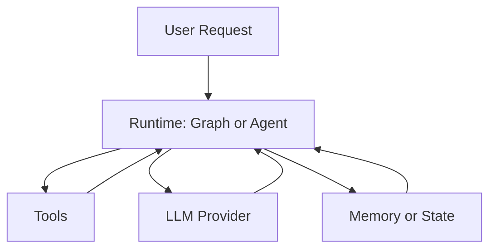

# Oris — Programmable AI execution runtime in Rust

*Stateful agent workflows, graphs, and tool execution without the Python tax.*

[](https://crates.io/crates/oris)
[](https://docs.rs/oris)

## What is Oris?

Oris is a **programmable AI execution runtime** for backend and infra engineers who want reliable, multi-step AI workflows in Rust. It gives you stateful graphs, agents with tools, persistence, and interrupts—so you can build agentic pipelines and LangGraph-style flows in one binary, with optional LLM and vector backends.

Think of it as **Temporal or Ray for AI**: a runtime for defining, running, and persisting AI workflows, not just prompt tooling.

## Why Oris?

- **Rust-native** — One binary, no Python runtime; fits into existing Rust services.
- **Stateful graphs** — Compose steps as nodes and edges; stream, persist, and time-travel.
- **Agents and tools** — Chat agents, multi-agent routing, subagents, and human-in-the-loop.
- **Pluggable backends** — OpenAI, Claude, Gemini, Mistral, Bedrock, Ollama; pgvector, Qdrant, SQLite, SurrealDB, and more via features.

## Quick start (30 seconds)

Add the crate and set your API key:

```bash
cargo add oris
export OPENAI_API_KEY="your-key"
```

Minimal LLM call:

```rust
use oris::{language_models::llm::LLM, llm::openai::OpenAI};

#[tokio::main]
async fn main() -> Result<(), Box<dyn std::error::Error>> {
    let llm = OpenAI::default();
    let response = llm.invoke("What is Rust?").await?;
    println!("{}", response);
    Ok(())
}
```

Hello-world state graph (no API key needed):

```rust
use oris::langgraph::{function_node, MessagesState, StateGraph, END, START};
use oris::schemas::messages::Message;

#[tokio::main]
async fn main() -> Result<(), Box<dyn std::error::Error>> {
    let mock_llm = function_node("mock_llm", |_state: &MessagesState| async move {
        use std::collections::HashMap;
        let mut update = HashMap::new();
        update.insert(
            "messages".to_string(),
            serde_json::to_value(vec![Message::new_ai_message("hello world")])?,
        );
        Ok(update)
    });

    let mut graph = StateGraph::<MessagesState>::new();
    graph.add_node("mock_llm", mock_llm)?;
    graph.add_edge(START, "mock_llm");
    graph.add_edge("mock_llm", END);

    let compiled = graph.compile()?;
    let initial_state = MessagesState::with_messages(vec![Message::new_human_message("hi!")]);
    let _final_state = compiled.invoke(initial_state).await?;
    Ok(())
}
```

## Architecture



## Key concepts

- **State graphs** — Define workflows as directed graphs; run, stream, and optionally persist state (e.g. SQLite or in-memory).
- **Agents and tools** — Give agents tools (search, filesystem, custom); use multi-agent routers and subagents.
- **Persistence and interrupts** — Checkpoint state, resume runs, and pause for human approval or review.

See the [examples](examples/) directory for runnable code.

## Install and config

```bash
cargo add oris
# With a vector store (e.g. PostgreSQL):
cargo add oris --features postgres
# With Ollama (local):
cargo add oris --features ollama
```

Common environment variables:

| Provider   | Variable           |
|-----------|--------------------|
| OpenAI    | `OPENAI_API_KEY`   |
| Anthropic | `ANTHROPIC_API_KEY` |
| Ollama    | `OLLAMA_HOST` (optional, default `http://localhost:11434`) |

## Examples and docs

- [Hello World graph](examples/langgraph_hello_world.rs)
- [Agent with tools](examples/agent.rs)
- [Streaming](examples/langgraph_streaming.rs)
- [Persistence](examples/langgraph_persistence_basic.rs)
- [Deep agent (planning + filesystem)](examples/deep_agent_basic.rs)

[API documentation](https://docs.rs/oris) · [Examples directory](examples/)

## License and attribution

MIT. This project includes code derived from [langchain-rust](https://github.com/langchain-ai/langchain-rust); see [LICENSE](LICENSE).

## Links

- [Crates.io](https://crates.io/crates/oris)
- [GitHub](https://github.com/fanjia1024/oris)
- [docs.rs](https://docs.rs/oris)
