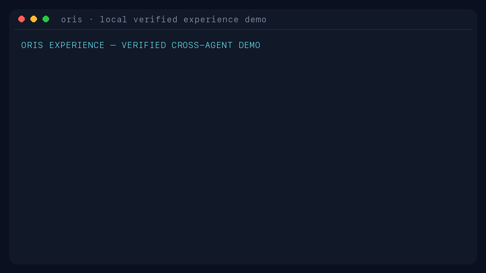

# Oris

**Oris is an AI self-evolution framework for supervised, bounded, closed-loop software improvement.**

[](https://crates.io/crates/oris-runtime)
[](https://docs.rs/oris-runtime)
[](https://codecov.io/gh/Colin4k1024/Oris)

---

## Why Oris

Most systems can execute tasks, but cannot systematically improve how they solve recurring problems.

Oris focuses on **closed-loop improvement** for AI software:

- Capture real signals from failures and regressions.
- Generate and validate candidate mutations safely.
- Promote proven solutions into reusable assets.
- Reuse successful solutions with confidence-aware replay.

Current checked-in boundary:

- Supervised, bounded, and auditable self-evolution.
- Experience capture, replay reuse, and fail-closed policy enforcement.
- No claim of fully autonomous issue discovery, merge, publish, or release.

See [the current project status note](docs/evokernel/current-project-status.md) for a concise external-facing statement of the shipped boundary.

## Use Oris with Your Coding Agent

Oris is not another coding agent. It is an evidence-backed procedural memory layer that lets Claude Code, Codex, OpenCode, Grok, and in-house agents reuse verified engineering experience without treating raw chat history as truth.

When connected, an agent can search before a recurring task, preserve applicability and safety boundaries, validate the procedure in its native sandbox, and record the real outcome. Three evidence-backed successes across at least two independent task contexts, with no failures, promote a local candidate to a stable portable Skill.



Run the repeatable local MCP scenario:

```bash
python3 scripts/demo_experience_onboarding.py
```

This deterministic demo uses the real Oris MCP server and SQLite control plane with Claude Code, Grok, and OpenCode caller identities; it does not invoke language models. See the [demo report](docs/experience-onboarding-demo-2026-08-12.md) for its assertions and evidence boundary, and the [real Claude Code/Grok E2E report](docs/agent-experience-e2e-2026-08-11.md) for model-level interoperability.

Start with the [Coding Agent onboarding guide](docs/coding-agent-onboarding.md). The accepted product direction—one-command detection, connection, diagnostics, and value reporting—is recorded in [ADR-0001](docs/architecture-decisions/0001-upstream-agent-experience-onboarding.md).

---

## Capability Boundary

| In Scope (Primary) | Supporting Layer | Not Primary in This README |
|---|---|---|
| Self-evolution loop and framework primitives | Durable execution and orchestration runtime | Exhaustive runtime API reference |
| Gene/Capsule lifecycle and confidence reuse | Storage/checkpoint backends and deployment integration | Detailed access policy, endpoint, and metrics contracts |
| Evolution-oriented scenario workflows | Production operations and integration surface | General-purpose workflow engine positioning |

---

## Self-Evolution Loop

The current implementation supports a **supervised closed-loop self-evolution path with bounded acceptance gating**. It does not yet claim a fully autonomous self-evolving agent or always-on autonomous release loop.

Oris implements an 8-stage self-evolution loop:

1. **Detect** — collect actionable signals from compiler/test/runtime outcomes.
2. **Select** — choose the best candidate gene or strategy.
3. **Mutate** — generate candidate changes from prior successful patterns.
4. **Execute** — run mutations in a controlled sandbox.
5. **Validate** — verify correctness and safety gates.
6. **Evaluate** — compare improvement versus regression.
7. **Solidify** — promote successful mutations into durable assets.
8. **Reuse** — replay proven assets with confidence tracking.

---

## EvoMap Alignment

Oris maps EvoMap concepts to concrete framework behavior:

| EvoMap Concept | Oris Mapping |
|---|---|
| Worker Pool | `EvolutionPipeline` stages |
| Task Queue | Signal intake and selection flow |
| Bounty System | Issue intake and prioritization |
| A2A Protocol | Stable `/a2a/*` compatibility boundary via `a2a-production`; broader evolution-network routes remain experimental |

See [EvoMap alignment details](docs/evomap-vs-oris-comparison.md).

---

## What You Can Build

- Self-improving AI agents that learn from failed runs.
- Supervised dev loops for bounded recurring issues.
- Evolution-aware replay pipelines with confidence lifecycle.
- Cross-agent knowledge exchange over an evolution network surface.

---

## Quick Start

```bash
git clone https://github.com/oris-project/oris.git && cd oris
cargo build --release
cargo run -p evo_oris_repo
```

Or add to your project:

```toml
[dependencies]
oris-runtime = { version = "0.61", features = ["sqlite-persistence", "evolution-experimental"] }
```

Run the first-run script with observable artifacts:

```bash
bash scripts/evo_first_run.sh
# Produces: target/evo_first_run/summary.json + run.log
```

See **[docs/quickstart.md](docs/quickstart.md)** for the full guide covering feature flags, observability, the execution server, and CI intake webhook setup.

---

## Components & Maturity

Maturity below reflects the current checked-in framework surface.

For the complete inventory of all 24 publishable Cargo packages—including primary entry points, low-level evolution components, compatibility tools, registry status, dependency order, and publication gaps—see the **[public crate catalog](docs/public-crates.md)**.

| Component | Crate | Maturity | Gate |
|---|---|---|---|
| Evolution Core | `crates/oris-evolution` | Standard supervised baseline with extended lifecycle primitives | `evolution` |
| Sandbox | `crates/oris-sandbox` | Standard supervised execution baseline | `evolution` |
| EvoKernel | `crates/oris-evokernel` | Standard supervised baseline with governor-aware capture | `evolution` |
| Intake | `crates/oris-intake` | Implemented baseline for issue intake/prioritization | standalone crate |
| Evolution Network | `crates/oris-evolution-network` | Standard protocol facade; `a2a-production` exposes only the stable A2A subset, while publish/fetch/revoke routes require `evolution-network-routes` | `evolution-network` |
| Economics | `crates/oris-economics` | Standard local EVU ledger and reputation accounting baseline; distributed settlement semantics remain outside the stable boundary | `economics` |
| Spec Contract | `crates/oris-spec` | Standard OUSL YAML parsing and mutation-plan compiler baseline; migration workflows remain future work | `spec-contract` |
| Experience Repository | `crates/oris-experience-repo` | v0.3.0 — Ed25519 signature verification fully enabled, PKI key registry, rate limiting on all endpoints | standalone crate |
| Full Framework Facade | `crates/oris-runtime` re-exports | Aggregate demo/test surface that still includes experimental wide routes | `full-evolution-experimental` |

---

## Runtime Integration (Brief)

The runtime layer is a **supporting integration surface** for hosting and operating the framework (execution server, workers, durable jobs). This README does not act as a runtime handbook; use the docs below when you need runtime-level details.

- [Production operations guide](docs/production-operations-guide.md)
- [Starter Axum integration example](examples/oris_starter_axum/README.md)
- [Runtime API contract](docs/runtime-api-contract.json)

---

## Learn More

- [EvoKernel docs index](docs/evokernel/README.md)
- [Evolution example suite](examples/evo_oris_repo/README.md)
- [Production operations guide](docs/production-operations-guide.md)
- [Evo example programs](docs/evokernel/examples.md)
- [EvoKernel overview](docs/evokernel-v0.1.md)

---

## Community / License

- License: [MIT](LICENSE)
- Attribution: This project includes code derived from [langchain-rust](https://github.com/langchain-ai/langchain-rust).
- Contribution guide: [CONTRIBUTING.md](CONTRIBUTING.md)
- Code of conduct: [CODE_OF_CONDUCT.md](CODE_OF_CONDUCT.md)
- Security policy: [SECURITY.md](SECURITY.md)
- Privacy notice: [PRIVACY.md](PRIVACY.md)
- Support guide: [SUPPORT.md](SUPPORT.md)
- Governance: [GOVERNANCE.md](GOVERNANCE.md)
- Crate: [crates.io/oris-runtime](https://crates.io/crates/oris-runtime)
- API docs: [docs.rs/oris-runtime](https://docs.rs/oris-runtime)
- Repository: [GitHub](https://github.com/Colin4k1024/Oris)
