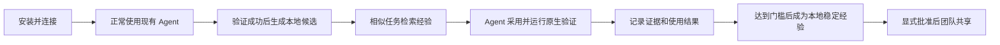

# ADR-0001：以上游 Agent 用户为中心的 Oris 经验接入路径

- 状态：Accepted
- 日期：2026-08-12
- 决策范围：Experience Control Plane、Agent 集成包、首次使用体验、价值度量
- 关联实现：`crates/oris-experience-repo`、`plugins/oris-experience`

## 背景

Oris 已经具备 Gene/Capsule/UsageReceipt 契约、证据校验、生命周期治理、MCP Server、Agent Skill 和跨 Agent 复用能力。但当前仓库的首要入口仍然面向框架贡献者：README 从 kernel、mutation、EvoMap 和 `cargo build` 开始，普通 Claude Code、Codex、OpenCode、Grok 或自研 Agent 用户无法快速回答以下问题：

1. Oris 是什么，和 Agent 自带 Memory 有什么区别？
2. 接入以后，现有 Coding Agent 的行为会发生什么变化？
3. 用户是否需要理解 Gene、Capsule 和 UsageReceipt？
4. 如何确认 Oris 已连接、正在工作，并且确实改善了结果？
5. 如何避免错误经验、秘密或恶意指令被持续复用？

真实 Claude Code/Grok 测试已经证明跨 Agent 的捕获、检索、采用、验证反馈和稳定晋升闭环可运行，但简单任务对照实验尚未证明 Token、时延或成功率提升。因此，产品入口必须同时做到容易理解、真实可运行和不夸大效果。

## 决策

### 1. 产品定位

面向上游用户时，Oris 定位为：

> Oris 不是另一个 Agent，而是不同 Agent 之间共享的、经过验证且可撤销的程序性经验层。

“AI self-evolution framework”继续作为框架和研究层定位；Coding Agent 用户入口首先使用“verified experience for agents”。

Oris 首版只处理工程程序性经验，例如编码、调试、迁移、构建、CI 和运维流程。原始聊天、一般事实、用户画像和个人偏好不进入经验控制面。

### 2. 渐进式概念暴露

首次使用界面不要求用户理解内部治理对象：

| 内部契约 | 普通用户文案 |
|---|---|
| Gene | Experience / Verified Procedure |
| Capsule | Validation Evidence |
| UsageReceipt | Usage Result |
| candidate | Learning |
| stable | Verified |
| quarantined | Blocked for Safety |
| promote | Approve Sharing |

Gene、Capsule、Receipt 和 `ExperienceBundleV1` 只出现在高级文档、SDK 和治理接口中。

### 3. 三类用户入口

#### Coding Agent 用户

用户保留原来的 Claude Code、Codex、OpenCode 或 Grok 工作方式。Oris 负责在后台完成结构化检索、使用跟踪和结果记录。

目标 CLI 体验为：

```text
oris init
oris connect --detect
oris doctor
oris status
```

这些命令是本 ADR 确定的目标产品接口，不代表当前版本已经交付。当前源码版本按 [Coding Agent 接入指南](../coding-agent-onboarding.md) 配置 MCP 和 Skill。

#### 团队治理用户

团队用户需要经验审查、显式发布、撤销和价值报告能力：

```text
oris experience review
oris experience publish <id>
oris experience revoke <id>
oris report
```

本地候选和本地稳定经验可以按生命周期规则自动处理；项目、团队和网络发布始终要求治理身份显式批准。

#### 自研 Agent / Agent 平台

自研 Agent 通过统一的生命周期中间件接入，而不是在业务逻辑中复制 MCP 细节：

```text
before_task         -> search
before_adoption     -> begin_use
after_validation    -> record_outcome
after_novel_success -> propose
```

标准集成面为 MCP；Rust、Python、TypeScript、Go SDK 和 LangChain/Eino 等 Middleware 是 MCP 之上的便捷层。平台必须保留调用 Agent 的权限、沙箱、审批和原生测试。

### 4. 首次价值路径

首次使用必须围绕三个连续的成功时刻设计：

1. **连接成功**：安装后五分钟内看到 Agent、MCP、Skill、数据目录和权限诊断全部通过。
2. **首次沉淀**：一个具有终态验证结果的真实任务自动产生本地候选，并展示证据摘要。
3. **首次复用**：另一个相似任务或另一个 Agent 检索到经验，检查边界，完成原生验证并记录结果。

达到至少三次验证成功、两个独立任务上下文、零失败后，用户看到本地经验从 Learning 晋升为 Verified。用户不需要手工构造 Bundle 或 Receipt。



### 5. Agent 内的自动化边界

- 只对可重复的工程任务触发检索，不对所有对话强制搜索。
- 结构化兼容性过滤优先于语义相似度。
- 检索结果是建议，不得绕过用户权限、Agent 沙箱或仓库规则。
- 采用经验前必须 `begin_use`；任务终态后必须 `record_outcome`。
- 成功结果必须包含测试或验收证据，无证据成功无效。
- 只有已经终结并通过验证的任务才可以 `propose`。
- 安全失败立即隔离；普通失败形成负证据并触发生命周期降级。
- Agent 通知只出现在候选创建、经验采用、晋升/降级/隔离等关键节点，内部 MCP 流程不打扰用户。

### 6. 部署模式

默认采用 local-first：无需账户、私有 SQLite、本机 Agent 共享同一个绝对数据路径。不同 Agent 若配置不同数据库，不构成跨 Agent 经验共享。

团队模式使用长期运行的 Oris 服务和治理身份，普通 Agent 仅获得 `experience:read` 与 `experience:write`；`experience:govern` 只授予审核和运营身份。

### 7. 产品交付面

Oris 上游产品由三个界面组成：

1. **独立 CLI/二进制**：安装、自动探测、连接、诊断、状态、卸载；终端用户不需要源码或 Rust 工具链。
2. **Agent Bridge**：共享 Skill、MCP 配置、必须执行的 Hook 和各 Agent 的轻量包装层。
3. **Value Report**：展示候选数、稳定经验、采用率、验证通过率、time-to-validation、成本、有害复用和隔离事件。

插件启动脚本从源码 `cargo run` 的行为只用于开发回退。正式分发必须安装固定版本、可校验的独立二进制。

## 可观测性与价值证明

“make agent better”必须通过对照数据证明，而不是通过经验数量推断。指标分三层：

### 激活指标

- 安装和连接成功率；
- `oris doctor` 全部通过率；
- 首个有证据候选的生成时间；
- 首次相关经验命中时间。

### 结果指标

- 有/无 Oris 的任务验证通过率；
- time-to-validation；
- 非缓存 Token 和货币成本；
- 经验采用后的验证成功率；
- 跨 Agent 成功复用率。

### 风险指标

- 无关任务可执行建议率；
- 失败复用率和连续失败数；
- 安全失败与隔离传播时延；
- 秘密、聊天原文和未脱敏证据进入候选的比例。

简单任务可以作为开销控制，但不能作为改善成功率的主要证据。README 和发布材料必须区分“闭环功能通过”与“效果基准通过”。

## 备选方案

### 继续以 Rust Framework 为第一入口

拒绝。它适合框架贡献者，但无法让 Coding Agent 用户在短时间内获得价值。

### 只提供 Memory 或向量数据库

拒绝。它不能表达验证合同、负向边界、证据、失败降级和安全隔离，也无法证明经验真实有效。

### 把经验直接写成 Agent Skill

拒绝。一次成功不应直接成为长期规则；缺少 Capsule/Receipt 和生命周期治理会放大错误复用。

### 每个 Agent 分别实现一套经验逻辑

拒绝。公共业务逻辑必须保留在统一契约、MCP Server 和共享 Skill 中，Agent 包装层只处理配置、Hook 和工具命名差异。

## 结果与代价

正向结果：

- 上游用户可以从自身 Agent 和业务问题开始理解 Oris；
- 多个 Agent 共享同一套经验与治理语义；
- 安装、连接、沉淀、复用和效果证明形成完整产品漏斗；
- 市场宣传与实际证据边界一致。

需要承担的代价：

- 需要新增稳定 CLI、二进制分发、自动探测和卸载能力；
- 需要维护各 Agent 配置差异和真实兼容性测试；
- 自动证据采集需要针对 Agent Hook 和任务终态做适配；
- 团队模式需要身份、持久化配置、发布审批和指标服务。

## 验收标准

1. 新用户不阅读框架架构即可在五分钟内完成一个 Agent 连接和诊断。
2. 首次任务无验证证据时，候选自动生成率为零。
3. 完整演示实际经过 MCP 完成候选、搜索、使用、回执和稳定晋升。
4. 三个 Agent 接收相同适用边界、安全约束和证据引用。
5. README 清楚说明用户收益、当前安装入口、演示性质和真实测试边界。
6. 发布前完成困难任务集的 Oris 开/关对照，不以单个简单任务宣称效率提升。

## 证据

- [确定性本地完整场景报告](../experience-onboarding-demo-2026-08-12.md)
- [Claude Code 与 Grok 真实跨 Agent E2E 报告](../agent-experience-e2e-2026-08-11.md)
- [Experience Control Plane](../experience-control-plane.md)
- [公共 Agent Skill](../../plugins/oris-experience/skills/oris-experience/SKILL.md)
