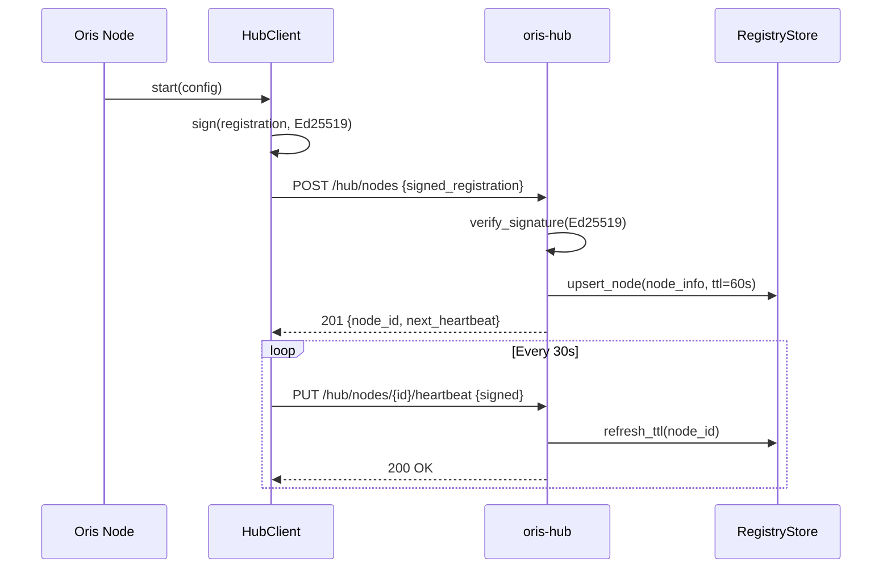
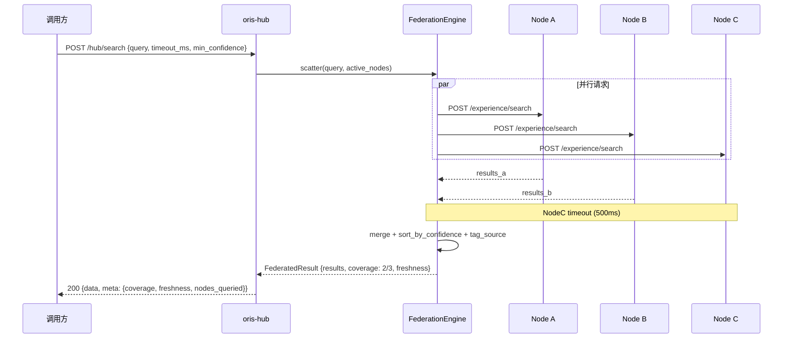
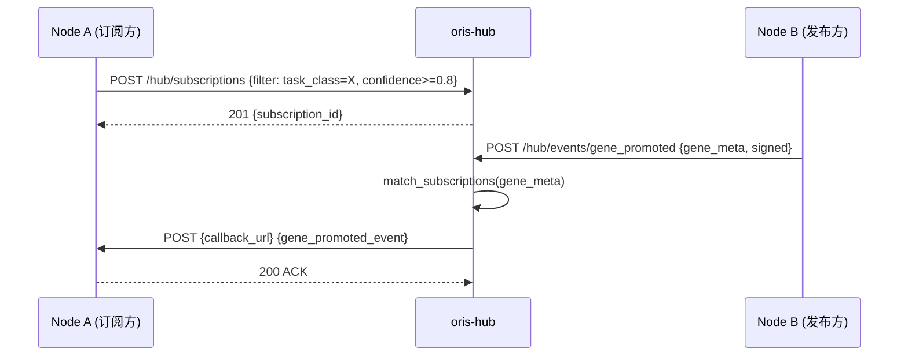

# Arch Design: Oris Experience Repository Hub

## 系统边界

```
┌─────────────────────────────────────────────────────────────────────┐
│                        External Boundary                             │
├─────────────────────────────────────────────────────────────────────┤
│                                                                      │
│  ┌──────────────┐   Register/Heartbeat    ┌──────────────────────┐  │
│  │  Oris Node A │ ──────────────────────► │                      │  │
│  │  (exp-repo)  │ ◄────── Discovery ───── │                      │  │
│  └──────────────┘                         │                      │  │
│                                           │    oris-hub           │  │
│  ┌──────────────┐   Register/Heartbeat    │    (Hub Server)      │  │
│  │  Oris Node B │ ──────────────────────► │                      │  │
│  │  (exp-repo)  │ ◄─── Federated Query ── │  ┌───────────────┐  │  │
│  └──────────────┘                         │  │ Dashboard SPA │  │  │
│                                           │  │ (embedded)    │  │  │
│  ┌──────────────┐   Register/Heartbeat    │  └───────────────┘  │  │
│  │  Oris Node C │ ──────────────────────► │                      │  │
│  │  (exp-repo)  │ ◄─── Subscription ───── │                      │  │
│  └──────────────┘                         └──────────────────────┘  │
│                                                      │               │
│                                              ┌───────┴───────┐      │
│                                              │  SQLite/PG    │      │
│                                              │  (metadata)   │      │
│                                              └───────────────┘      │
└─────────────────────────────────────────────────────────────────────┘
```

### 外部依赖

| 依赖 | 类型 | 作用 |
|------|------|------|
| oris-experience-repo 节点 | 网络 | 下游经验仓库实例 |
| OEN 网络 Ed25519 PKI | 库 | 节点身份验证 |
| SQLite/PostgreSQL | 存储 | Hub 元数据持久化 |

### 边界内外划分

- **边界内**：Hub 服务端（注册、发现、联邦路由、订阅、Dashboard serving）
- **边界外**：Gene/Capsule 内容存储（留在各节点）、Economics 计量、ACL 多租户

---

## 组件拆分

### 新增 Crates

| Crate | 职责 | 位置 |
|-------|------|------|
| `oris-hub` | Hub 服务端：注册中心、联邦查询引擎、订阅管理、Dashboard serve | `crates/oris-hub/` |
| `oris-hub-client` | Client SDK：注册、心跳、发现、订阅 | `crates/oris-hub-client/` |

### 新增前端

| 目录 | 职责 |
|------|------|
| `hub-dashboard/` | React + Vite SPA，构建为静态资源 embed 到 Hub 进程 |

### `oris-hub` 内部模块

```
oris-hub/src/
├── lib.rs              // 公共 re-export
├── config.rs           // HubConfig (bind addr, db path, TLS, auth)
├── registry/           // 节点注册中心
│   ├── mod.rs
│   ├── service.rs      // RegistryService: register, heartbeat, deregister, gc
│   ├── store.rs        // RegistryStore trait + SQLite impl
│   └── types.rs        // NodeInfo, NodeStatus, Registration
├── discovery/          // 节点发现
│   ├── mod.rs
│   ├── service.rs      // DiscoveryService: list, filter, health_check
│   └── types.rs        // DiscoveryQuery, DiscoveryResult
├── federation/         // 联邦查询引擎
│   ├── mod.rs
│   ├── engine.rs       // FederationEngine: scatter-gather, timeout, merge
│   ├── router.rs       // 路由策略: broadcast / targeted / random-subset
│   └── types.rs        // FederatedQuery, FederatedResult, NodeResponse
├── subscription/       // 订阅与推送
│   ├── mod.rs
│   ├── manager.rs      // SubscriptionManager: create, match, dispatch
│   ├── store.rs        // SubscriptionStore trait + SQLite impl
│   └── types.rs        // Subscription, SubscriptionFilter, PushEvent
├── api/                // HTTP 路由
│   ├── mod.rs
│   ├── routes.rs       // Router 组装
│   ├── registry_handlers.rs
│   ├── discovery_handlers.rs
│   ├── federation_handlers.rs
│   ├── subscription_handlers.rs
│   └── dashboard_handlers.rs  // stats, node_health, gene_detail
├── middleware/         // 中间件
│   ├── mod.rs
│   ├── auth.rs         // Ed25519 验签 + API Key
│   └── rate_limit.rs   // 注册/心跳 rate limit
├── server.rs           // HubServer: axum app 组装 + static serve
└── error.rs            // HubError
```

### `oris-hub-client` 内部模块

```
oris-hub-client/src/
├── lib.rs
├── client.rs           // HubClient: register, heartbeat_loop, discover, search, subscribe
├── config.rs           // HubClientConfig (hub_url, node_id, keypair, heartbeat_interval)
├── types.rs            // Re-export Hub API types
└── error.rs            // HubClientError
```

---

## 关键数据流

### 注册流



### 联邦查询流



### 订阅推送流



---

## 接口约定

### Hub API (oris-hub)

| Method | Path | 认证 | 用途 |
|--------|------|------|------|
| POST | `/hub/nodes` | Ed25519 签名 | 节点注册 |
| PUT | `/hub/nodes/{id}/heartbeat` | Ed25519 签名 | 心跳续约 |
| DELETE | `/hub/nodes/{id}` | Ed25519 签名 | 主动注销 |
| GET | `/hub/nodes` | API Key | 发现节点列表 |
| GET | `/hub/nodes/{id}` | API Key | 节点详情 |
| POST | `/hub/search` | API Key | 联邦聚合查询 |
| POST | `/hub/subscriptions` | API Key | 创建订阅 |
| GET | `/hub/subscriptions` | API Key | 列出订阅 |
| DELETE | `/hub/subscriptions/{id}` | API Key | 删除订阅 |
| POST | `/hub/events/gene_promoted` | Ed25519 签名 | Gene 晋升事件上报 |
| GET | `/hub/stats` | API Key | 统计概览（Dashboard 用） |
| GET | `/hub/nodes/{id}/health` | API Key | 节点健康详情 |
| GET | `/*` | 无/可选 | Dashboard SPA 静态资源 |

### 协议

- HTTP/1.1 + TLS（可选 HTTP/2）
- JSON body
- Ed25519 签名放在 `X-OEN-Signature` header
- API Key 放在 `Authorization: Bearer <key>` header

---

## 技术选型

| 类别 | 选择 | 原因 |
|------|------|------|
| Hub 服务框架 | axum 0.8 | 与 experience-repo 一致，团队熟悉 |
| 异步运行时 | tokio | 统一 |
| HTTP 客户端 | reqwest 0.12 | 支持超时、连接池、TLS |
| 签名验证 | ed25519-dalek 2 | 与 OEN 一致 |
| 元数据存储 | rusqlite (SQLite) | 轻量，可选 PostgreSQL |
| Rate Limit | governor 0.7 | 与 experience-repo 一致 |
| 前端框架 | React 18 + Vite | 成熟生态，快速迭代 |
| 前端 UI 库 | shadcn/ui + Tailwind | 轻量、可定制 |
| 图表 | Recharts | React 友好，轻量 |
| 静态资源 serve | tower-http ServeDir | axum 生态内 |

---

## 风险与约束

| 风险 | 影响 | 缓解 |
|------|------|------|
| 联邦查询延迟不可控 | 用户体验差 | 设 500ms 全局超时 + 降级返回已收集结果 |
| 节点频繁注册/注销 | Hub 压力 | Rate limit (10 req/min per IP) + 最小心跳 15s |
| SQLite 写入并发 | 高注册量场景性能瓶颈 | WAL 模式 + 后续可切 PostgreSQL |
| Dashboard 安全 | 管理界面暴露 | Bearer token + 可选 IP 白名单 |
| 单 Hub 单点故障 | 全网不可发现 | 节点本地缓存 peer list，Hub 重启后自动恢复 |

---

## 最后更新

2026-05-12 | architect
