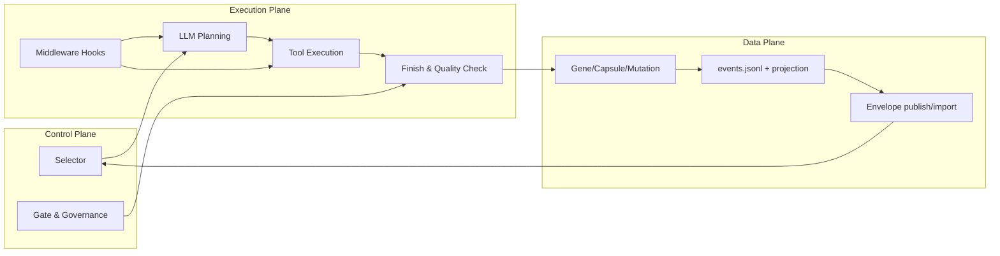
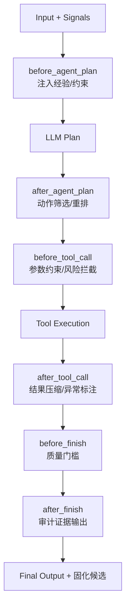
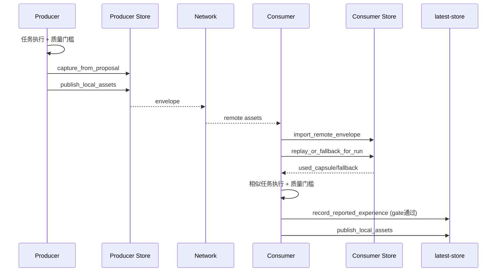
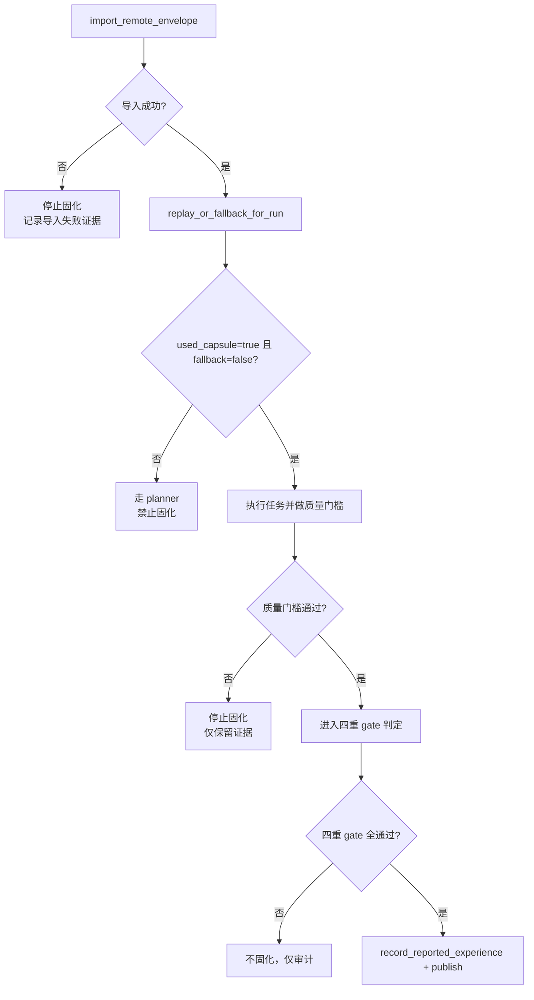
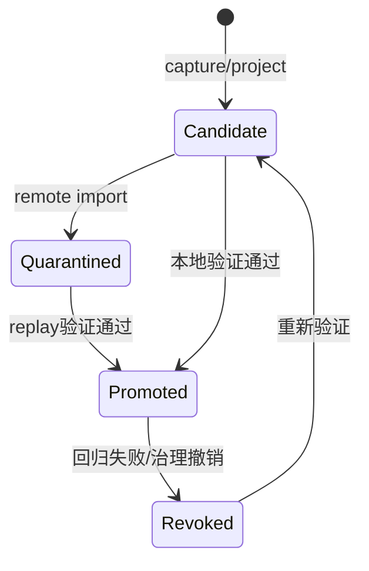

# Agent 经验资产校验与复用、LLM 干涉机制详细设计（白皮书扩展版）

> 版本定位：在既有白皮书基础上升级为“现状（Current）+ 增强（Proposed）双轨”设计说明。  
> 读者：管理层（价值/风险/治理）+ 工程层（可实现/可复盘/可审计）。

---

## 1. 执行摘要（管理层视角）

Oris 当前已跑通两条经验资产链路：
- 旅游长线任务链路：`capture -> publish -> import -> replay -> gate -> solidify`
- 官方经验复用链路：`ensure_builtin -> fetch -> publish -> import -> replay -> qwen task`

本设计文档回答三个关键问题：
1. 经验资产如何在 Agent 中被校验并安全复用；
2. 经验资产如何干涉 LLM 的规划与执行（Hook 级别）；
3. 如何形成可追责的证据链，避免误固化和经验污染。

---

## 2. 控制平面 / 数据平面 / 执行平面分层（核心章节 1）

### 2.1 分层职责
- 控制平面（Control Plane）：策略选择、门槛判定、固化治理。
- 数据平面（Data Plane）：Gene/Capsule/Mutation/Event 的持久化与传输。
- 执行平面（Execution Plane）：LLM 规划、工具执行、middleware 干预、输出生成。

### 2.2 三平面架构图（Mermaid 图 1）



### 2.3 现状 vs 增强

| 维度 | Current（已实现） | Proposed（增强设计） |
|---|---|---|
| 分层边界 | 通过示例与现有 API 形成事实边界 | 提炼统一策略接口，减少示例内逻辑分散 |
| 控制平面 | 四重 gate + replay 判定已可用 | 引入可配置策略 profile（不同任务线） |
| 执行平面 | middleware 支持全链路 hook | 增加“经验干预中间件编排器” |

---

## 3. Hook 级干涉设计（核心章节 2，重点）

### 3.1 设计目标
让“经验资产”不仅作为离线参考，而是成为 LLM 规划/执行时的在线约束与增强信号。

### 3.2 Hook 干涉总表（6 个 hook 全覆盖）

| Hook | 输入 | 干涉动作 | 输出 | 失败策略 | 审计事件 | Current 现状 | Proposed 增强 |
|---|---|---|---|---|---|---|---|
| `before_agent_plan` | PromptArgs + steps | 注入经验摘要、约束与优先级 | 修改后的输入 | 注入失败则回退原输入 | `before_agent_plan` | 已支持 middleware 注入 | 经验注入模板化、按信号自动分级 |
| `after_agent_plan` | AgentEvent | 过滤风险 action、重排候选动作 | 修改后的 event | 无可行动作则 fallback | `after_agent_plan` | 已支持事件改写 | 增加 action 风险评分与拒绝原因 |
| `before_tool_call` | AgentAction | 参数规范化、越权拦截 | 修改后的 action | 拦截并返回解释性错误 | `tool_call_before` | 已支持工具前拦截 | 结合资产策略白名单强约束 |
| `after_tool_call` | action + observation | 结果压缩、异常标注、脱敏 | 修改后的 observation | 异常触发 retry/fallback | `tool_call_after` | 已支持工具后处理 | 加入 outcome 可信度评分 |
| `before_finish` | AgentFinish | 最小质量门槛检查、结构补全 | 修改后的 finish | 质量不达标拒绝 finish | `before_finish` | 已支持 finish 前校验 | 引入任务契约校验器 |
| `after_finish` | finish + result | 审计摘要、证据索引写出 | Side effects only | 审计写出失败不阻塞主流程 | `finish` | 已支持收尾 side effects | 自动生成固化候选包 |

### 3.3 LLM 干涉控制图（Mermaid 图 2）



### 3.4 干涉动作清单（规划/工具/结束）
- 规划阶段：经验提示注入、候选动作优先级、风险动作预筛。
- 工具阶段：参数规范化、危险调用拦截、结果压缩与可信度标注。
- 结束阶段：结构完整性检查、回滚方案补全、失败中止条件。

---

## 4. 校验与复用闭环设计（核心章节 3）

### 4.1 闭环流程语义
- `import_remote_envelope`：导入远端资产，默认进入可验证路径。
- `replay_or_fallback_for_run`：决定命中复用还是回退 planner。
- 关键判定：
  - `used_capsule=true`：命中可复用经验。
  - `fallback_to_planner=false`：未回退通用规划路径。

### 4.2 端到端时序图（Mermaid 图 3）



### 4.3 校验与复用决策树（Mermaid 图 4）



### 4.4 现状 vs 增强

| 维度 | Current（已实现） | Proposed（增强设计） |
|---|---|---|
| 判定核心 | `used_capsule` + `fallback_to_planner` | 增加命中置信分层和解释标签 |
| 校验粒度 | 任务级质量门槛 | 增加工具级与轮次级子门槛 |
| 复用失败处置 | fallback + 不固化 | 自动恢复 playbook |

---

## 5. 固化策略与治理（核心章节 4）

### 5.1 当前四重 gate
1. producer 质量通过  
2. consumer 导入成功  
3. replay 命中（`used_capsule=true` 且 `fallback=false`）  
4. consumer 相似任务质量通过

仅四重 gate 全通过，允许调用：
- `record_reported_experience`
- `publish_local_assets`（面向后续 Agent）

### 5.2 治理增强（Proposed）
- 置信度分层（L1/L2/L3）决定固化节奏。
- 自动降权：复用失败率升高时降低被选中概率。
- 自动撤销：策略失效时转 `Revoked` 并阻断继续传播。

### 5.3 资产状态机图（Mermaid 图 5）



### 5.4 现状 vs 增强

| 维度 | Current（已实现） | Proposed（增强设计） |
|---|---|---|
| 固化门槛 | 四重 gate 已稳定 | 门槛策略化与多任务线分级 |
| 风险控制 | 失败不固化 | 失败后自动降权/撤销 |
| 发布模式 | latest-store 本地传播 | 支持多节点分级发布策略 |

---

## 6. 观测与审计设计（核心章节 5）

### 6.1 证据链对齐规则
同一 run 必须可在 4 层证据互相印证：
1. 阶段日志（终端）  
2. 生命周期事件（`events.jsonl`）  
3. 实时日志（`agent_realtime.jsonl`，官方链路）  
4. 验证报告（`validation_report.md` / `verification_report.md`）

### 6.2 最小审计查询顺序
1. 看报告：gate/replay/solidify 是否通过。  
2. 看 replay 证据：`used_capsule`、`fallback_to_planner`、`reason`。  
3. 下钻事件：`remote_asset_imported -> promotion_evaluated -> capsule_reused`。  

### 6.3 必备审计字段
- `run_id`
- `gene_id`, `capsule_id`, `mutation_id`
- `used_capsule`, `fallback_to_planner`
- `phase`, `event`, `timestamp`
- `quality_gate_result`

### 6.4 现状 vs 增强

| 维度 | Current（已实现） | Proposed（增强设计） |
|---|---|---|
| 审计入口 | 报告 + events + replay + realtime | 增加自动交叉校验脚本 |
| 粒度 | run 级复盘 | 迭代轮次级（iteration）复盘 |
| 结论生成 | 人工判读 | 自动 verdict 生成 |

---

## 7. 失败与回退标准化（四类故障）

| 故障类型 | 停止条件 | 证据最小集 | 恢复动作 |
|---|---|---|---|
| replay miss | `used_capsule=false` 或 `fallback=true` | replay_evidence + selector 输入 | 走 planner，补充 signals 后重试 |
| 命中但质量失败 | 质量门槛任一失败 | 质量检查清单 + 输出片段 | 禁止固化，调优提示词/工具约束 |
| 导入失败 | `import_remote_envelope` 非 accepted 或导入空 | import 结果 + envelope 元数据 | 校验资产格式与状态映射后重导 |
| 日志不一致 | 报告结论与 events/realtime 计数矛盾 | report + events_summary + realtime summary | 以 events.jsonl 重建报告并复核 |

---

## 8. 真实证据锚点（固定 run）

### 8.1 自进化旅游链路
- `docs/evokernel/demo_runs/run-1773120588/validation_report.md`
- `docs/evokernel/demo_runs/run-1773120588/solidification_summary.json`
- `docs/evokernel/demo_runs/run-1773120588/store_upgrade_summary.json`

关键证据：
- `all_passed=true`
- `reported_gene_id=reported-travel-run-1773120588-...`
- `latest_consumer_publish_assets=3`

### 8.2 官方经验复用链路
- `docs/evokernel/official_reuse_runs/run-1773113670/verification_report.md`
- `docs/evokernel/official_reuse_runs/run-1773113670/replay_evidence.json`
- `docs/evokernel/official_reuse_runs/run-1773113670/agent_realtime.jsonl`

关键证据：
- `used_capsule=true`
- `fallback_to_planner=false`
- `token_chunk_events=191`
- `tool_call_events=12`

### 8.3 latest-store 基线
- `docs/evokernel/latest-store/producer/{events.jsonl,genes.json,capsules.json}`
- `docs/evokernel/latest-store/consumer/{events.jsonl,genes.json,capsules.json}`

---

## 9. 公共接口影响
- 不新增/修改稳定 API、类型签名或协议。
- 文档引用接口均基于当前实现：
  - `capture_from_proposal`
  - `publish_local_assets`
  - `import_remote_envelope`
  - `replay_or_fallback_for_run`
  - `record_reported_experience`
  - `ensure_builtin_experience_assets`

---

## 10. 复现命令与验收标准

```bash
# 官方经验复用（含实时日志）
QWEN_API_KEY=... cargo run -p oris-runtime --example agent_official_experience_reuse --features "full-evolution-experimental"

# 自进化旅游链路（含迁移 + gate + 固化）
QWEN_API_KEY=... cargo run -p oris-runtime --example agent_self_evolution_travel_network --features "full-evolution-experimental"
```

验收标准：
- 两条命令至少各成功一次；
- 报告路径可定位；
- replay 判定字段可追溯；
- 事件证据与报告结论一致。

---

## 11. Assumptions（明确边界）
- 中文为主，关键术语保留英文（Hook/Replay/Fallback/Promote）。
- `Current` 仅描述已验证实现；`Proposed` 仅是增强设计，不等价于已落地。
- 证据基线固定当前真实 run；后续只替换 run_id 和统计，不改机制结构。
