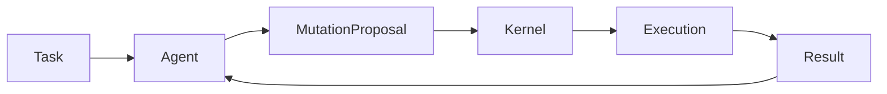

# Oris Agent Runtime Contract Specification


> **Implementation Status: In Progress** 🔄
Source: https://www.notion.so/317e8a70eec5808b9b0bd35bc45b4e91

Last synced: March 5, 2026

## Current Implementation Snapshot (March 5, 2026)

The current `crates/oris-agent-contract` crate is a proposal-only contract scaffold:

- `AgentTask`
- `MutationProposal`
- `ExecutionFeedback`
- `AgentCapabilityLevel`
- `ProposalTarget`
- A2A protocol constants (`oris.a2a@0.1.0-experimental`)
- A2A handshake request/response and capability negotiation envelope types
- A2A task lifecycle and standard error envelope types
- direct `oris_runtime::agent_contract` access is gated by `agent-contract-experimental`
- `examples/evo_oris_repo` exercises the proposal path through `oris-runtime` with `full-evolution-experimental`
- the checked-in replay example uses `EvoKernel::replay_or_fallback_for_run(...)` so reuse events stay attributable to the current replay execution
- execution-server exposes experimental `POST /v1/evolution/a2a/handshake` for protocol and capability negotiation when both `agent-contract-experimental` and `evolution-network-experimental` are enabled
- execution-server enforces negotiated A2A capabilities for `/v1/evolution/publish`, `/v1/evolution/fetch`, and `/v1/evolution/revoke` when `agent-contract-experimental` is enabled
- when `sqlite-persistence` is enabled, negotiated A2A sessions are persisted in runtime repository storage and survive process restart
- negotiated sessions are bound to authenticated caller identity (`actor_type`, `actor_id`, `actor_role`) when auth is enabled
- execution-server records A2A task lifecycle events (`Queued`, `Running`, `Succeeded`, `Failed`, `Cancelled`) for runtime task execution stages
- lifecycle events are retrievable by `task_id` through `GET /v1/evolution/a2a/tasks/:task_id/lifecycle`
- replay failures and worker supervised acknowledgements are mapped into lifecycle terminal transitions
- execution-server exposes remote A2A task session routes:
  - `POST /v1/evolution/a2a/sessions/start`
  - `POST /v1/evolution/a2a/sessions/:session_id/dispatch`
  - `POST /v1/evolution/a2a/sessions/:session_id/progress`
  - `POST /v1/evolution/a2a/sessions/:session_id/complete`
  - `GET /v1/evolution/a2a/sessions/:session_id?sender_id=<id>&protocol_version=<version>`

Remote task session protocol contract (experimental):

- start (mandatory): `sender_id`, `protocol_version`, `task_id`, `task_summary`
- dispatch (mandatory): `sender_id`, `protocol_version`, `dispatch_id`, `summary`
- progress (mandatory): `sender_id`, `protocol_version`, `progress_pct`, `summary`, `retryable`
- progress (optional): `retry_after_ms`
- complete (mandatory): `sender_id`, `protocol_version`, `terminal_state`, `summary`, `retryable`, replay feedback basis fields (`used_capsule`, `reasoning_steps_avoided`, `task_class_id`, `task_label`)
- complete (optional): `retry_after_ms`, `failure_code`, `failure_details`, `capsule_id`, `fallback_reason`

Remote task session state machine:

`Started -> Dispatched -> InProgress (repeatable) -> Completed | Failed | Cancelled`

Protocol compatibility:

- runtime requires `protocol_version == 0.1.0-experimental`
- incompatible versions fail with deterministic `400` error message: `incompatible a2a task session protocol version`

A2A execution privilege model (experimental):

- privilege profile is derived from negotiated `capability_level`:
  - `A0`/`A1` -> `observer`
  - `A2`/`A3` -> `operator`
  - `A4` -> `governor`
- runtime enforces both negotiated capability membership and privilege profile allow-list
- denied and allowed privileged checks are recorded into audit logs with principal + capability + reason fields

Privilege matrix:

| Action | Observer | Operator | Governor |
| --- | --- | --- | --- |
| `evolution.fetch` | allow | allow | allow |
| `evolution.publish` | deny | allow | allow |
| `evolution.revoke` | deny | deny | allow |
| `a2a.task_session.start/dispatch/progress/complete` | deny | allow | allow |
| `a2a.task_session.snapshot` | allow | allow | allow |
| `a2a.task_lifecycle.read` | allow | allow | allow |

Recommended deployment defaults:

- default external peers to `A1` + `EvolutionFetch` only (observer read path)
- grant CI/operator peers `A3` for publish + remote task session flows, but keep revoke out
- reserve `A4` governor profile for tightly scoped internal principals that must revoke assets

Not yet implemented in the checked-in code:

- cross-node negotiated session propagation

## Related Documents

- [devloop.md](devloop.md)
- [kernel.md](kernel.md)
- [spec.md](spec.md)

## 1. Purpose

This document defines how agents interact with the Oris kernel. Agents are
external intelligence executors bound by a strict runtime contract.

This separation guarantees:

- kernel stability
- deterministic evolution
- safe agent interoperability
- multi-agent compatibility

## 2. Architectural Position

Agents operate above the kernel boundary:

```text
Agent
v
Agent Runtime Contract
v
Mutation Interface
v
Oris Kernel
```

Agents never directly modify system state.

## 3. Agent Design Philosophy

An Oris agent is:

> A mutation proposal generator operating under deterministic execution constraints.

Agents:

- propose actions
- generate mutations
- interpret results

Agents do not:

- persist intelligence
- modify evolution assets
- bypass validation
- access kernel internals

## 4. Agent Responsibilities

Agents must provide:

1. Task interpretation
2. Mutation proposal
3. Execution reasoning
4. Result interpretation

The kernel handles:

- execution
- validation
- evolution
- replay
- governance

## 5. Agent Runtime Lifecycle



Lifecycle stages:

- task intake
- mutation proposal
- kernel execution
- result feedback
- iteration

## 6. Mutation Contract

Agents express change as a mutation proposal:

```rust
struct MutationProposal {
    intent: String,
    files: Vec<String>,
    expected_effect: String,
}
```

The kernel converts this into executable mutation state. The current contract is intentionally narrow and does not grant direct execution authority.

Contract rules:

- no direct filesystem access
- no execution privileges
- no state persistence
- no evolution authority

## 7. Agent Context Model

Context may include:

- task description
- execution feedback
- replay hints
- selected capsules

Agents must remain stateless and cannot rely on hidden memory.

## 8. Replay-Aware Execution

Before agent reasoning:

```text
Kernel attempts Replay
```

If replay succeeds, agent reasoning is skipped. Agents must tolerate
non-invocation.

When replay auditability matters, the caller should supply a run id through
`EvoKernel::replay_or_fallback_for_run(...)`. The convenience
`EvoKernel::replay_or_fallback(...)` path remains valid and auto-generates a
replay run id.

## 9. Multi-Agent Compatibility

Compatible agents may include:

- Codex-based coding agents
- Claude-style reasoning agents
- autonomous planners
- domain-specific repair agents

Interoperability comes from the shared mutation contract.

## 10. Agent Isolation

Agents execute outside the kernel trust boundary. This preserves:

- kernel integrity
- evolution safety
- deterministic history

Agents are replaceable.

## 11. Agent Capability Levels

| Level | Capability |
| --- | --- |
| A0 | Single mutation |
| A1 | Iterative repair |
| A2 | Planning agent |
| A3 | Multi-step executor |
| A4 | Cooperative agent |

Higher capability does not grant higher trust.

## 12. Agent Failure Handling

Failure includes:

- invalid mutation
- unsafe proposal
- repeated validation failure

Kernel response:

- reject mutation
- request retry
- fallback replay
- terminate session

Evolution remains unaffected.

## 13. Agent Observability

Metrics:

- proposal success rate
- validation pass ratio
- replay avoidance rate
- mutation efficiency

Used for evaluation, not evolution authority.

## 14. Agent Upgrade Model

Agents may evolve independently. The kernel preserves backward compatibility via
contract stability.

## 15. Non-Goals

Agents must not:

- rewrite kernel modules
- alter evolution store
- bypass governor checks
- publish network assets directly

## 16. Long-Term Vision

```text
Agents compete
Kernel evolves
System improves
```

Oris separates intelligence generation from intelligence survival.

## 17. Repository Placement

```text
oris/
`- agents/
   |- codex/
   |- planner/
   |- repair/
   `- experimental/
```

## 18. Completion Criteria

Integration is complete when:

- agents operate without kernel modification
- replay replaces repeated reasoning
- multiple agents coexist safely
- evolution remains deterministic
