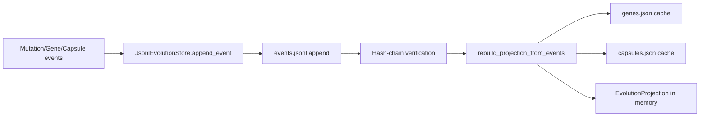
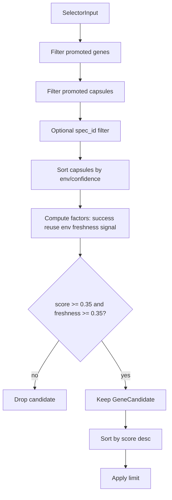

# Evolution Module Documentation

This document covers the Evo module implementation across:

- `crates/oris-evolution`
- `crates/oris-evolution-network`

It is based on the current code in this repository as of March 5, 2026.

## Module Overview

The evolution module provides an append-only memory system for mutation outcomes and reuse:

- `oris-evolution` is the domain and storage crate.
- `oris-evolution-network` is the protocol contract crate for sharing assets/events across nodes.

At a high level:

1. Mutations and outcomes are emitted as `EvolutionEvent`s.
2. Events are persisted in a hash-chained JSONL log.
3. A projection is rebuilt from events (`Gene`, `Capsule`, counters, timestamps, spec links).
4. Selectors rank reusable genes/capsules from that projection.
5. Optional network messages package genes/capsules/events into signed-by-hash envelopes.

## Crate Structure

### `crates/oris-evolution`

```text
src/
  lib.rs        # re-exports core API
  core.rs       # domain model, event store, projection rebuild, selector scoring, tests
```

`lib.rs` is a thin re-export:

```rust
mod core;
pub use core::*;
```

### `crates/oris-evolution-network`

```text
src/
  lib.rs        # protocol enums, envelope, request/response structs
```

## API Documentation (`oris-evolution`)

## Domain Types

- ID aliases:
  - `MutationId = String`
  - `GeneId = String`
  - `CapsuleId = String`
- Constants:
  - `REPLAY_CONFIDENCE_DECAY_RATE_PER_HOUR = 0.05`
  - `MIN_REPLAY_CONFIDENCE = 0.35`

Main enums/structs:

- Lifecycle and metadata:
  - `AssetState`: `Candidate | Promoted | Revoked | Archived | Quarantined`
  - `CandidateSource`: `Local | Remote`
  - `BlastRadius { files_changed, lines_changed }`
- Mutation modeling:
  - `RiskLevel`
  - `ArtifactEncoding` (`UnifiedDiff`)
  - `MutationTarget`: `WorkspaceRoot | Crate { name } | Paths { allow }`
  - `MutationIntent`
  - `MutationArtifact`
  - `PreparedMutation`
- Validation and runtime context:
  - `ValidationSnapshot`
  - `Outcome`
  - `EnvFingerprint`
- Core assets:
  - `Gene`
  - `Capsule`

## Event Model

`EvolutionEvent` is a tagged enum (`kind` in snake_case). Variants:

- Mutation lifecycle:
  - `MutationDeclared`
  - `MutationApplied`
  - `SignalsExtracted`
  - `MutationRejected`
  - `ValidationPassed`
  - `ValidationFailed`
- Capsule lifecycle:
  - `CapsuleCommitted`
  - `CapsuleQuarantined`
  - `CapsuleReleased`
  - `CapsuleReused`
  - `ReplayEconomicsRecorded`
- Gene lifecycle:
  - `GeneProjected`
  - `GenePromoted`
  - `GeneRevoked`
  - `GeneArchived`
  - `PromotionEvaluated`
- Federation/spec metadata:
  - `RemoteAssetImported`
  - `ManifestValidated`
  - `SpecLinked`

`PromotionEvaluated` includes both:

- `reason` (human-readable explanation)
- `reason_code` (`TransitionReasonCode`, machine-readable and stable for regression/audit)

`ReplayEconomicsRecorded` is emitted on every replay decision (hit or fallback) and carries:

- `reason_code` (`ReplayRoiReasonCode`)
- `reasoning_avoided_tokens`
- `replay_fallback_cost`
- `replay_roi`
- task-class dimensions (`task_class_id`, `task_label`)
- optional cross-node dimensions (`source_sender_id`, `asset_origin`)

Stored records use:

- `StoredEvolutionEvent { seq, timestamp, prev_hash, record_hash, event }`

## Projection Model

`EvolutionProjection` contains:

- `genes: Vec<Gene>`
- `capsules: Vec<Capsule>`
- `reuse_counts: BTreeMap<GeneId, u64>`
- `attempt_counts: BTreeMap<GeneId, u64>`
- `last_updated_at: BTreeMap<GeneId, String>`
- `spec_ids_by_gene: BTreeMap<GeneId, BTreeSet<String>>`

It is built by:

- `rebuild_projection_from_events(events: &[StoredEvolutionEvent]) -> EvolutionProjection`

Behavioral highlights:

- Tracks gene and capsule state transitions from events.
- Tracks attempt counts from committed capsules and validation events.
- Tracks reuse counts from `CapsuleReused`.
- Maintains spec-to-gene links from both:
  - inline `MutationIntent.spec_id`
  - explicit `SpecLinked` events

## Storage API

Traits:

- `EvolutionStore`:
  - `append_event`
  - `scan`
  - `rebuild_projection`
  - `scan_projection` (default implementation: `scan(1)` + projection rebuild from same event slice)

Concrete store:

- `JsonlEvolutionStore`:
  - `new(root_dir)`
  - `root_dir()`
  - Implements `EvolutionStore` with an internal mutex.

On-disk layout (under root dir):

- `LOCK`
- `events.jsonl`
- `genes.json` (projection cache)
- `capsules.json` (projection cache)

Integrity:

- Each append computes `record_hash = hash(seq, timestamp, prev_hash, event)`.
- Reads validate strict hash-chain continuity (`seq`, `prev_hash`, `record_hash`).
- Tampering causes `EvolutionError::HashChain`.

## Selector API

Types:

- `SelectorInput { signals, env, spec_id, limit }`
- `GeneCandidate { gene, score, capsules }`
- `Selector` trait (`select`)

Implementations:

- `ProjectionSelector::new(projection)`
- `ProjectionSelector::with_now(projection, now)` (deterministic testing / injected time)
- `StoreBackedSelector::new(Arc<dyn EvolutionStore>)`

Selection pipeline in `ProjectionSelector`:

1. Keep only `Promoted` genes with at least one `Promoted` capsule.
2. Optional `spec_id` filter against `projection.spec_ids_by_gene`.
3. Sort each gene's capsules by env match, then confidence, then id.
4. Compute score:
   - `success_rate = successful_capsules / attempts`
   - `reuse_count_factor = 1 + ln(1 + successful_reuses)`
   - `env_match_factor = 0.5 + 0.5 * (matched_env_fields / 4)`
   - `freshness_factor = max(decayed_confidence) / peak_confidence`
   - `signal_overlap = normalized signal phrase overlap`
   - `score = success_rate * reuse_count_factor * env_match_factor * freshness_factor * signal_overlap`
5. Reject if:
   - decayed confidence `< MIN_REPLAY_CONFIDENCE (0.35)`, or
   - final score `< 0.35`
6. Sort candidates by score desc, tie-break by gene id, truncate to `max(limit, 1)`.

## Utility API

- `default_store_root() -> PathBuf` (`.oris/evolution`)
- `hash_string(&str) -> String`
- `stable_hash_json<T: Serialize>(&T) -> Result<String, EvolutionError>`
- `compute_artifact_hash(payload: &str) -> String`
- `next_id(prefix: &str) -> String`
- `decayed_replay_confidence(confidence, age_secs) -> f32`

## API Documentation (`oris-evolution-network`)

Network protocol types:

- `MessageType`: `Publish | Fetch | Report | Revoke`
- `NetworkAsset`:
  - `Gene { gene }`
  - `Capsule { capsule }`
  - `EvolutionEvent { event }`
- `EvolutionEnvelope`:
  - `protocol`
  - `protocol_version`
  - `message_type`
  - `message_id`
  - `sender_id`
  - `timestamp`
  - `assets`
  - `content_hash`
- Request/response structs:
  - `PublishRequest`
  - `FetchQuery`
  - `FetchResponse`
  - `RevokeNotice`

Envelope helpers:

- `EvolutionEnvelope::publish(sender_id, assets)`:
  - sets protocol to `oen`
  - sets protocol version to `0.1`
  - assigns `message_type = Publish`
  - generates timestamp and message id
  - computes `content_hash`
- `compute_content_hash()`: deterministic SHA-256 over key envelope payload fields.
- `verify_content_hash()`: integrity check (`recomputed == content_hash`).

## Usage Examples

## 1) Persist events and rebuild projection

```rust
use oris_evolution::{
    ArtifactEncoding, AssetState, Capsule, EnvFingerprint, EvolutionEvent, EvolutionStore, Gene,
    JsonlEvolutionStore, MutationArtifact, MutationIntent, MutationTarget, Outcome, PreparedMutation,
    RiskLevel,
};

let root = std::env::temp_dir().join("oris-evolution-doc-example");
let store = JsonlEvolutionStore::new(&root);

let mutation = PreparedMutation {
    intent: MutationIntent {
        id: "mutation-1".into(),
        intent: "fix borrow error".into(),
        target: MutationTarget::Crate { name: "oris-kernel".into() },
        expected_effect: "cargo check passes".into(),
        risk: RiskLevel::Low,
        signals: vec!["borrow checker error".into()],
        spec_id: Some("spec-123".into()),
    },
    artifact: MutationArtifact {
        encoding: ArtifactEncoding::UnifiedDiff,
        payload: "diff --git a/src/lib.rs b/src/lib.rs ...".into(),
        base_revision: Some("HEAD".into()),
        content_hash: oris_evolution::compute_artifact_hash(
            "diff --git a/src/lib.rs b/src/lib.rs ..."
        ),
    },
};

store.append_event(EvolutionEvent::MutationDeclared { mutation })?;
store.append_event(EvolutionEvent::GeneProjected {
    gene: Gene {
        id: "gene-1".into(),
        signals: vec!["borrow checker error".into()],
        strategy: vec!["narrow mutable borrow scope".into()],
        validation: vec!["cargo check -p oris-kernel".into()],
        state: AssetState::Promoted,
    },
})?;
store.append_event(EvolutionEvent::CapsuleCommitted {
    capsule: Capsule {
        id: "capsule-1".into(),
        gene_id: "gene-1".into(),
        mutation_id: "mutation-1".into(),
        run_id: "run-1".into(),
        diff_hash: "abc123".into(),
        confidence: 0.82,
        env: EnvFingerprint {
            rustc_version: "rustc 1.80.0".into(),
            cargo_lock_hash: "lock-hash".into(),
            target_triple: "x86_64-unknown-linux-gnu".into(),
            os: "linux".into(),
        },
        outcome: Outcome {
            success: true,
            validation_profile: "oris-default".into(),
            validation_duration_ms: 2100,
            changed_files: vec!["crates/oris-kernel/src/lib.rs".into()],
            validator_hash: "validator-sha".into(),
            lines_changed: 12,
            replay_verified: false,
        },
        state: AssetState::Promoted,
    },
})?;

let (_events, projection) = store.scan_projection()?;
assert_eq!(projection.genes.len(), 1);
assert_eq!(projection.capsules.len(), 1);
# Ok::<(), oris_evolution::EvolutionError>(())
```

## 2) Rank candidates for replay

```rust
use oris_evolution::{EnvFingerprint, ProjectionSelector, Selector, SelectorInput};

let selector = ProjectionSelector::new(projection);
let selected = selector.select(&SelectorInput {
    signals: vec!["borrow checker error".into()],
    env: EnvFingerprint {
        rustc_version: "rustc 1.80.0".into(),
        cargo_lock_hash: "lock-hash".into(),
        target_triple: "x86_64-unknown-linux-gnu".into(),
        os: "linux".into(),
    },
    spec_id: Some("spec-123".into()),
    limit: 3,
});

for candidate in selected {
    println!("gene={} score={}", candidate.gene.id, candidate.score);
}
```

## 3) Build and verify an OEN publish envelope

```rust
use oris_evolution_network::{EvolutionEnvelope, NetworkAsset};

let envelope = EvolutionEnvelope::publish(
    "node-a",
    vec![NetworkAsset::Gene {
        gene: projection.genes[0].clone(),
    }],
);

assert_eq!(envelope.protocol, "oen");
assert_eq!(envelope.protocol_version, "0.1");
assert!(envelope.verify_content_hash());
```

## Architecture Diagrams

## Event storage and projection



## Selector scoring flow



## Network packaging flow

```mermaid
flowchart LR
    A[Gene/Capsule/EvolutionEvent] --> B[NetworkAsset]
    B --> C[EvolutionEnvelope.publish]
    C --> D[content_hash = SHA-256(payload tuple)]
    D --> E[Transmit envelope]
    E --> F[Receiver verify_content_hash]
```

## Current Test Coverage Snapshot

Commands run:

- `cargo test -p oris-evolution`
- `cargo test -p oris-evolution-network`

Observed results:

- `oris-evolution`: 16 unit tests passed, 0 failed, 0 doc tests.
- `oris-evolution-network`: 0 unit tests defined, 0 doc tests.

`oris-evolution` tests currently cover:

- hash-chain tamper detection
- projection rebuild and cache regeneration
- spec-id tracking from declaration and `SpecLinked`
- selector ordering/spec-filtering/env matching/freshness decay
- backward-compatible deserialization for legacy events
