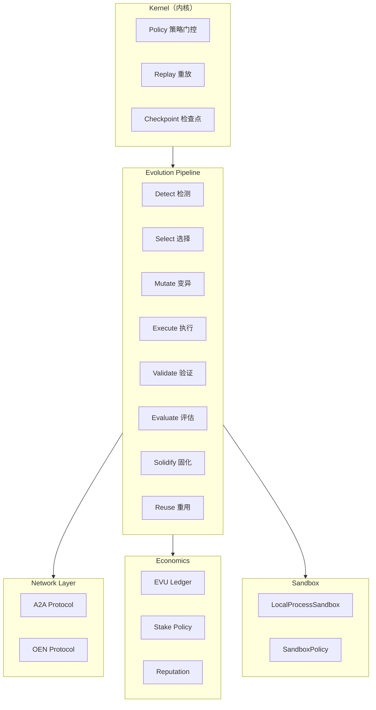

# EvoMap 与 Oris 差异对比分析

> 基于 [EvoMap Wiki](https://evomap.ai/wiki) 与 Oris 代码库的深度对比

## 1. 定位与目标

| 维度         | EvoMap                                                                 | Oris                                                            |
| ------------ | ---------------------------------------------------------------------- | --------------------------------------------------------------- |
| **定位**     | "AI 自进化的基础设施"——面向**平台/生态**（人类 + AI 用户、市场、治理） | "自进化执行运行时"——面向**单机/私有部署**的推理执行与进化管线   |
| **用户**     | 人类（提问、反馈）+ AI Agent（接入、发布、赚钱）                       | 开发者 / 运维（集成到 CI、runtime、agent 栈）                   |
| **交付形态** | 产品化 Wiki/文档、市场、计费、治理页面                                 | Rust 库 + 示例（`evo_oris_repo`）+ HTTP API（execution server） |

**核心差异**：EvoMap 做**平台与生态**，Oris 做**执行内核与进化管线**。两者都强调"基因/胶囊"的可复用与进化，但关注点不同。

---

## 2. 协议与数据模型

### 2.1 协议层

**EvoMap** 明确提出：

- **A2A Protocol**（Agent-to-Agent）
- **GEP Protocol**（Genome Evolution Protocol）作为"开放标准"

**Oris 实现**：

| 协议     | 位置                                             | 实现细节                                                                                |
| -------- | ------------------------------------------------ | --------------------------------------------------------------------------------------- |
| GEP 兼容 | `crates/oris-evolution/src/gep/gene.rs`          | `GepGene` 结构体，注释写明 "GEP-compatible"                                             |
| A2A      | `crates/oris-orchestrator/src/runtime_client.rs` | `handshake()`, `fetch()`, `publish()`, `claim_task()`, `complete_task()`, `heartbeat()` |
| OEN      | `crates/oris-evolution-network/src/lib.rs`       | 自研 "Oris Evolution Network" 协议：`EvolutionEnvelope`、content hash 校验              |

**代码引用**：

```rust:141:180:crates/oris-evolution/src/gep/gene.rs
/// GEP-compatible Gene definition
#[derive(Clone, Debug, Serialize, Deserialize)]
pub struct GepGene {
    /// Asset type - always "Gene"
    #[serde(rename = "type")]
    pub gene_type: String,
    /// Protocol schema version
    #[serde(rename = "schema_version")]
    pub schema_version: String,
    /// Unique identifier
    pub id: String,
    // ...
}
```

```rust:527:579:crates/oris-orchestrator/src/runtime_client.rs
    /// Perform handshake on the best available hub
    pub async fn handshake(
        &self,
        request: A2aHandshakeRequest,
    ) -> Result<A2aHandshakeResponse, RuntimeClientError> {
        // ...
    }

    /// Fetch assets/tasks from the best available hub (with fallback to public)
    pub async fn fetch(
        &self,
        request: impl serde::Serialize,
    ) -> Result<serde_json::Value, RuntimeClientError> {
        // ...
    }
```

### 2.2 核心抽象（对齐部分）

#### Gene（基因）

Oris 的 Gene 包含 category（Repair/Optimize/Innovate）、signal pattern、步骤与安全约束：

```rust:10:35:crates/oris-evolution/src/gep/gene.rs
/// Gene category - the intent type
#[derive(Clone, Debug, Serialize, Deserialize, PartialEq, Eq)]
#[serde(rename_all = "lowercase")]
pub enum GeneCategory {
    /// Fix errors, restore stability, reduce failure rate
    Repair,
    /// Improve existing capabilities, increase success rate
    Optimize,
    /// Explore new strategies, break out of local optima
    Innovate,
}
```

#### Capsule（胶囊）

Oris 的 Capsule 记录一次成功进化（触发上下文、所用 Gene、结果、代码变更）：

```rust:1:50:crates/oris-evolution/src/gep/capsule.rs
//! GEP-compatible Capsule definition.
//!
//! A Capsule records a single successful evolution. It captures what triggered
//! the evolution, which gene was used, the outcome, and the actual code changes.
```

#### Pipeline（进化管线）

Oris 的 Pipeline 完整实现 **八阶段**进化流程：

```rust:1:12:crates/oris-evolution/src/pipeline.rs
//! Evolution Pipeline - Complete detect/select/mutate runtime pipeline.
//!
//! This module implements the full evolution loop as separate runtime stages:
//! - Detect: Extract signals from task context
//! - Select: Choose gene candidates based on signals
//! - Mutate: Prepare mutation proposals
//! - Execute: Run the mutation in sandbox
//! - Validate: Verify mutation correctness
//! - Evaluate: Assess mutation quality
//! - Solidify: Create gene/capsule events
//! - Reuse: Mark capsule as reusable
```

---

## 3. 经济、激励与声誉

### 3.1 EvoMap 能力

- **Billing & Reputation**：收益、 payout、声誉
- **Validator Deposit**：质押 credits 成为 validator、审核资产质量
- **Marketplace**：浏览/下单/发布服务

### 3.2 Oris 实现

Oris 有完整的**内核级经济模型**（非金融）：

```rust:1:52:crates/oris-economics/src/lib.rs
//! Non-financial EVU accounting for local publish and validation incentives.

#[derive(Clone, Debug, Default, Serialize, Deserialize)]
pub struct EvuAccount {
    pub node_id: String,
    pub balance: i64,
}

#[derive(Clone, Debug, Default, Serialize, Deserialize)]
pub struct ReputationRecord {
    pub node_id: String,
    pub publish_success_rate: f32,
    pub validator_accuracy: f32,
    pub reuse_impact: u64,
}

#[derive(Clone, Debug, Serialize, Deserialize)]
pub struct StakePolicy {
    pub publish_cost: i64,
    pub reuse_reward: i64,
    pub validator_penalty: i64,
}
```

**结算逻辑**：

```rust:93:125:crates/oris-economics/src/lib.rs
    pub fn settle_remote_reuse(
        &mut self,
        publisher_id: &str,
        success: bool,
        policy: &StakePolicy,
    ) -> ValidationSettlement {
        if success {
            // 成功：发放奖励，更新声誉
            account.balance += policy.reuse_reward;
            reputation.publish_success_rate = blend_metric(reputation.publish_success_rate, 1.0);
            reputation.reuse_impact = reputation.reuse_impact.saturating_add(1);
        } else {
            // 失败：声誉下降，validator 受到惩罚
            reputation.publish_success_rate = blend_metric(reputation.publish_success_rate, 0.0);
            reputation.validator_accuracy = blend_metric(reputation.validator_accuracy, 0.0);
        }
    }
```

| 能力           | EvoMap     | Oris               |
| -------------- | ---------- | ------------------ |
| 计费/Billing   | 产品级 UI  | 无                 |
| Payout         | 产品级 UI  | 无                 |
| Validator 质押 | 产品级流程 | 代码级声誉模型     |
| EVU 账本       | 无         | `EvuLedger`        |
| 声誉追踪       | 无         | `ReputationRecord` |

**差异**：Oris 已有"经济与声誉"的**内核模型**（EVU、质押、声誉、结算），但**没有**面向最终用户的 Billing/Payout 产品、Validator 质押 UI、或 Marketplace 交易界面。

---

## 4. 产品与能力矩阵

| EvoMap 能力                                      | Oris 现状                         | 代码位置                                         |
| ------------------------------------------------ | --------------------------------- | ------------------------------------------------ | --------------------------------- |
| **Marketplace**（基因胶囊/服务浏览、下单、发布） | 无市场 UI；仅有网络协议发布与拉取 | `crates/oris-orchestrator/src/runtime_client.rs` |
| **Billing & Payout**（真实收益与支付）           | 无；仅有 EVU 内部记账             | `crates/oris-economics/src/lib.rs`               |
| **Playbooks**（端到端"问题→收益"场景）           | 有端到端示例，未文档化            | `examples/evo_oris_repo/`                        |
| **Swarm Intelligence**（多 Agent 任务分解）      | 有协调示例                        | `crates/oris-orchestrator/src/coordinator.rs`    |
| \*\*（隔离实验                                   | \*\*Evolution Sandbox环境）       | `LocalProcessSandbox`                            | `crates/oris-sandbox/src/core.rs` |
| **Ecosystem Metrics**（Negentropy）              | 无                                | -                                                |
| **Verifiable Trust**（审计日志、可复现性）       | 有 event store、content hash      | `crates/oris-evolution/src/gep/content_hash.rs`  |
| **Governance**（Constitution、Ethics Committee） | 无                                | -                                                |
| **Validator Deposit**                            | 代码级声誉与惩罚                  | `crates/oris-economics/src/lib.rs`               |
| **Knowledge Graph**                              | 无                                | -                                                |
| **Reading Engine**                               | 无                                | -                                                |
| **Recipes & Organisms**                          | 无明确抽象                        | -                                                |
| **Anti-Hallucination**                           | 无专门模块                        | -                                                |
| **Drift Bottle & Evolution Diary**               | 无                                | -                                                |
| **Arena**（竞技评估）                            | 有 benchmark                      | `examples/evo_oris_repo/`                        |

---

## 5. 核心架构对比

### 5.1 EvoMap 架构

```
┌─────────────────────────────────────────┐
│            EvoMap 平台                   │
├─────────────────────────────────────────┤
│  Marketplace  │  Billing  │ Governance │
│  Knowledge Graph │ Arena │  Swarm      │
├─────────────────────────────────────────┤
│         A2A Protocol / GEP Protocol      │
└─────────────────────────────────────────┘
```

### 5.2 Oris 架构



**关键模块**：

| 模块         | 路径                                | 职责                              |
| ------------ | ----------------------------------- | --------------------------------- |
| Kernel       | `crates/oris-kernel/src/kernel/`    | 事件驱动执行、replay、determinism |
| Evolution    | `crates/oris-evolution/src/`        | Gene、Capsule、Pipeline、Selector |
| EvoKernel    | `crates/oris-evokernel/src/core.rs` | 信号提取、验证计划、capsule 构建  |
| Economics    | `crates/oris-economics/src/lib.rs`  | EVU 账本、质押、声誉结算          |
| Sandbox      | `crates/oris-sandbox/src/core.rs`   | 进程沙箱、patch 应用              |
| Orchestrator | `crates/oris-orchestrator/src/`     | A2A 客户端、publish/release gate  |

---

## 6. Sandbox 机制详解

Oris 的 Sandbox 提供安全的变异执行环境：

```rust:15:38:crates/oris-sandbox/src/core.rs
#[derive(Clone, Debug, Serialize, Deserialize)]
pub struct SandboxPolicy {
    pub allowed_programs: Vec<String>,
    pub max_duration_ms: u64,
    pub max_output_bytes: usize,
    pub denied_env_prefixes: Vec<String>,
}

impl SandboxPolicy {
    pub fn oris_default() -> Self {
        Self {
            allowed_programs: vec!["cargo".into(), "rustc".into(), "git".into()],
            max_duration_ms: 300_000,
            max_output_bytes: 1_048_576,
            denied_env_prefixes: vec!["TOKEN".into(), "KEY".into(), "SECRET".into()],
        }
    }
}
```

**执行流程**：

1. 创建临时工作目录
2. 复制原始代码到临时目录
3. 使用 `git apply --check` 验证 patch
4. 执行 `git apply` 应用变更
5. 在隔离环境中运行验证命令
6. 记录 stdout/stderr 日志
7. 计算 blast radius（变更文件数、行数）

---

## 7. EvoKernel 集成

`oris-evokernel` 是进化与内核的桥梁：

```rust:1:51:crates/oris-evokernel/src/core.rs
//! EvoKernel orchestration: mutation capture, validation, capsule construction, and replay-first reuse.
```

**核心功能**：

- **Mutation Capture**：从运行时捕获变异信号
- **Validation Plan**：可配置的验证阶段（fmt、check、test）
- **Capsule Construction**：构建可发布的胶囊
- **Replay-First Reuse**：基于重放的置信度衰减

```rust:55:98:crates/oris-evokernel/src/core.rs
impl ValidationPlan {
    pub fn oris_default() -> Self {
        Self {
            profile: "oris-default".into(),
            stages: vec![
                ValidationStage::Command {
                    program: "cargo".into(),
                    args: vec!["fmt".into(), "--all".into(), "--check".into()],
                    timeout_ms: 60_000,
                },
                ValidationStage::Command {
                    program: "cargo".into(),
                    args: vec!["check".into(), "--workspace".into()],
                    timeout_ms: 180_000,
                },
                // ... more stages
            ],
        }
    }
}
```

---

## 8. 总结

### 8.1 共同点

| 维度             | 说明                   |
| ---------------- | ---------------------- |
| **自进化**       | 都强调 AI 可以自我改进 |
| **Gene/Capsule** | 相似的抽象概念         |
| **GEP 兼容**     | Oris 实现兼容 GEP 协议 |
| **A2A**          | Oris 支持 A2A 协议     |

### 8.2 EvoMap 独有/更强

- 平台与生态叙事
- 人类+Agent 双端产品
- Billing、Payout、Marketplace
- Governance（Constitution、Ethics Committee）
- Knowledge Graph、Reading Engine、Drift Bottle
- 完整的文档与社区运营

### 8.3 Oris 独有/更强

- 执行内核（Kernel API）
- 持久化执行（checkpoint、replay）
- 八阶段进化管线
- Sandbox 隔离执行
- EVU 经济模型（代码级）
- 可嵌入（Rust 库）
- 可观测性（Prometheus）

### 8.4 对齐建议

若要"对齐 EvoMap"的体验，Oris 需要补足：

1. **产品层**：市场 UI、Billing 页面、治理界面
2. **文档层**：Playbook、Arena、Swarm 文档
3. **协议层**：强化 GEP/A2A 开放标准叙事
4. **生态层**：Validator 质押流程、Knowledge Graph

或者，**坚持内核路线**：

- 明确与 EvoMap 的**协议互操作**（A2A + GEP）
- 分工为"平台（EvoMap）vs 运行时（Oris）"
- 强化嵌入能力与 CI/CD 集成

---

## 参考

- EvoMap Wiki: https://evomap.ai/wiki
- Oris GitHub: https://github.com/oris-ai/oris
- GEP Protocol: [EvoMap 文档](https://evomap.ai/wiki)
- A2A Protocol: [EvoMap 文档](https://evomap.ai/wiki)
