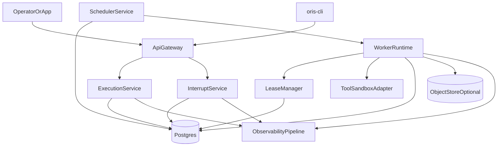
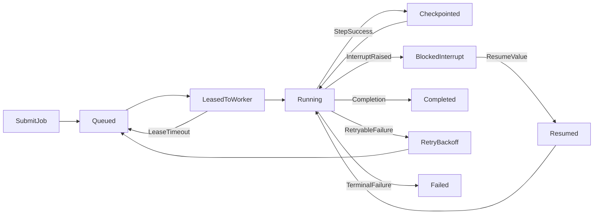
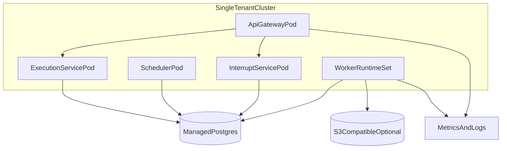

# Oris v1 OS Architecture (Single-Tenant Self-Hosted)

This document defines the production architecture for **Oris v1** as a
Reasoning Workflow OS, not only a runtime library.

It is intentionally scoped to single-tenant private deployment and built on top
of the current Oris kernel/graph capabilities documented in:

- [docs/ORIS_2.0_STRATEGY.md](docs/ORIS_2.0_STRATEGY.md)
- [docs/kernel-api.md](docs/kernel-api.md)
- [docs/durable-execution.md](docs/durable-execution.md)

## 1. v1 Boundary (Must Have vs Non-Goals)

### 1.1 Must Have in v1

1. **Execution Control Plane**
   - Job submission/query/cancel/resume/replay API.
   - Scheduler and lease manager.
   - Operator CLI.
2. **Execution Data Plane**
   - Worker runtime that runs Oris compiled graphs/agents.
   - Heartbeat, lease extension, step report, interrupt report.
3. **Durable Storage**
   - PostgreSQL as system of record for jobs, events, checkpoints, interrupts, leases.
   - Optional object store for large blobs (state payloads, tool logs, trace export).
4. **Reliability Contract**
   - At-least-once execution with idempotent transitions.
   - Recover from worker crash and lease timeout.
   - Replay from event log + checkpoint tail.
5. **Operator Surfaces**
   - REST/gRPC API + CLI (`run`, `list`, `inspect`, `resume`, `cancel`, `replay`).
   - Readable run timeline and interrupt queue.

### 1.2 Explicit Non-Goals in v1

- Multi-tenant control plane.
- Global distributed consensus scheduling across regions.
- Complex policy DSL and billing system.
- Full visual low-code graph authoring.
- Cross-cluster disaster recovery automation (manual runbook only in v1).

## 2. System Architecture

### 2.1 Component Topology

### 2.2 Planes and Responsibilities

- **Control Plane**
  - `ApiGateway`: authn/authz, request routing, idempotency key validation.
  - `ExecutionService`: job lifecycle orchestration and API facade.
  - `SchedulerService`: pick dispatchable attempts and assign leases.
  - `LeaseManager`: heartbeat, lease renewal, expiration scanning.
  - `InterruptService`: pending interrupt queue and resume handling.
- **Data Plane**
  - `WorkerRuntime`: executes steps using Oris kernel/graph adapters.
  - `ToolSandboxAdapter`: controlled integration boundary for tool IO.
- **Storage Plane**
  - `Postgres`: source of truth for run state machine and event ledger.
  - `ObjectStoreOptional`: large payload offload.
- **Observability Plane**
  - structured logs + metrics + traces keyed by `run_id`, `attempt_id`, `seq`.

## 3. End-to-End Execution Lifecycle

### 3.1 State Transition Rules (Core)

- `Queued -> LeasedToWorker`: only if no active lease exists.
- `Running -> BlockedInterrupt`: only with persisted interrupt payload.
- `BlockedInterrupt -> Resumed`: requires operator/app resume command with value.
- `Running -> RetryBackoff`: requires failure classified retryable by policy.
- Any terminal state (`Completed`, `Failed`, `Cancelled`) is immutable.

## 4. API Contracts (v1)

Both REST and gRPC can exist; REST surface below is normative for v1.

### 4.1 Job API

- `POST /v1/jobs`
  - create job/run.
  - supports `idempotency_key`.
- `GET /v1/jobs/{run_id}`
  - current status, current attempt, lease holder, updated timestamps.
- `POST /v1/jobs/{run_id}/cancel`
  - cooperative cancellation request.
- `POST /v1/jobs/{run_id}/resume`
  - resume from pending interrupt with payload.
- `POST /v1/jobs/{run_id}/replay`
  - create replay attempt from a checkpoint or sequence.
- `GET /v1/jobs/{run_id}/history`
  - timeline events and checkpoints.

### 4.2 Worker API

- `POST /v1/workers/poll`
  - returns leaseable attempt.
- `POST /v1/workers/{worker_id}/heartbeat`
  - updates lease liveness and execution watermark.
- `POST /v1/workers/{worker_id}/extend-lease`
  - explicit lease extension.
- `POST /v1/workers/{worker_id}/report-step`
  - append step event(s), optional checkpoint metadata.
- `POST /v1/workers/{worker_id}/ack`
  - mark terminal completion/failure/cancelled.

### 4.3 Interrupt API

- `GET /v1/interrupts?status=pending&run_id=...`
- `GET /v1/interrupts/{interrupt_id}`
- `POST /v1/interrupts/{interrupt_id}/resume`
- `POST /v1/interrupts/{interrupt_id}/reject`

## 5. Data Model (Postgres Source of Truth)

### 5.1 Tables

- `jobs`
  - run identity and user-facing status.
- `job_attempts`
  - retry/replay attempts, scheduler state.
- `leases`
  - active lease ownership and heartbeat timeout.
- `events`
  - append-only event log (`seq` monotonic per run).
- `checkpoints`
  - state snapshot metadata (`at_seq` included).
- `interrupts`
  - pending/handled interrupt records and resume payload refs.
- `tool_invocations`
  - tool action call metadata, timings, result refs.

### 5.2 Key Columns (Minimum)

- `jobs(run_id PK, workflow_name, status, created_at, updated_at, idempotency_key UNIQUE NULLS NOT DISTINCT)`
- `job_attempts(attempt_id PK, run_id FK, attempt_no, status, retry_at, started_at, ended_at, last_error)`
- `leases(lease_id PK, attempt_id FK UNIQUE, worker_id, lease_expires_at, heartbeat_at, version)`
- `events(run_id, seq, event_type, payload_json, created_at, PRIMARY KEY(run_id, seq))`
- `checkpoints(checkpoint_id PK, run_id FK, attempt_id FK, at_seq, payload_ref, payload_json NULL, created_at)`
- `interrupts(interrupt_id PK, run_id FK, attempt_id FK, status, request_payload_json, resume_payload_json NULL, created_at, resumed_at NULL)`
- `tool_invocations(invocation_id PK, run_id FK, attempt_id FK, action_id, tool_name, status, latency_ms, request_ref, response_ref, created_at)`

### 5.3 Indexes

- `job_attempts(run_id, status, retry_at)`
- `leases(lease_expires_at)`
- `events(run_id, created_at)`
- `interrupts(status, created_at)`
- `checkpoints(run_id, created_at DESC)`

## 6. Reliability and Consistency Rules

### 6.1 Core Guarantees

- **Execution Semantics**: at-least-once per step attempt.
- **Durability**: event append committed before status transition visibility.
- **Replay**: state rebuild = latest checkpoint + events where `seq > at_seq`.
- **Interrupt Safety**: run cannot leave `BlockedInterrupt` without persisted resume decision.

### 6.2 Write Ordering (Critical)

For each step execution:
1. append `ActionRequested` / step-start event.
2. execute action/tool/node.
3. append terminal step event (`ActionSucceeded` or `ActionFailed`).
4. append `StateUpdated` and optional checkpoint metadata.
5. then update `job_attempts.status`.

### 6.3 Lease and Failover

- Worker must heartbeat within `lease_ttl / 2`.
- Scheduler requeues attempt if `lease_expires_at < now()` and no terminal ack.
- Lease version check prevents split-brain dual ownership.
- Requeued attempt loads checkpoint/event tail and continues.

### 6.4 Idempotency

- `POST /v1/jobs` uses `idempotency_key` to prevent duplicate runs.
- Worker `report-step` must include `action_id` and dedupe token.
- Duplicate resume requests on same interrupt return same result (no double apply).

## 7. Security and Isolation (Self-Hosted Baseline)

- mTLS between control plane and workers.
- Signed worker registration token with short TTL.
- Tool sandbox network policy with explicit egress allow-list.
- Audit log for `cancel`, `resume`, `replay`, and operator identity.

## 8. Deployment Topology (v1)

## 9. 6-Month Delivery Plan

### Phase 1 (Weeks 1-6): Durable Core

- Implement Postgres-backed `events`, `checkpoints`, `job_attempts`, `leases`.
- Build single-node scheduler and lease expiration requeue logic.
- Integrate worker runtime with checkpoint resume path.

**Exit Criteria**
- crash recovery test passes with process kill during running step.
- replay equivalence test passes on fixed event stream.

### Phase 2 (Weeks 7-14): Execution Server + Operator API

- Ship `ExecutionService` + REST endpoints for run/list/inspect/resume/replay/cancel.
- Deliver `oris-cli` operator commands aligned with API.
- Add run timeline endpoint and checkpoint inspection.

**Exit Criteria**
- operator can complete: `run -> interrupt -> resume -> inspect -> replay`.

### Phase 3 (Weeks 15-22): Distributed Workers

- Worker registration, heartbeat, lease extension, failover.
- Backpressure control (poll window, max active leases per worker).
- Retry backoff strategy enforcement at scheduler layer.

**Exit Criteria**
- lease timeout failover under load test is deterministic and recoverable.

### Phase 4 (Weeks 23-26): Execution Console

- DAG view, step timeline, interrupt queue, tool invocation detail.
- Status drill-down by `run_id` and `attempt_id`.
- Export run timeline for audit.

**Exit Criteria**
- on-call operator can diagnose failed run without DB shell access.

## 10. Acceptance Gates (Must Pass for v1)

1. **Crash Recovery**: worker/process crash resumes from latest checkpoint/event tail.
2. **Replay Correctness**: identical event history yields identical final state.
3. **Interrupt Loop**: interrupt is visible, auditable, and resumable with value.
4. **Operator Coverage**: CLI/API support run/list/inspect/resume/replay/cancel.
5. **Failover Safety**: lease expiry never causes concurrent dual execution of one attempt.

## 11. Risks and Kill Criteria

### 11.1 Top Risks

- Library-level abstractions leak into service contracts, causing unstable APIs.
- Event/checkpoint ordering bugs break replay guarantees.
- Lease timeout tuning causes duplicate work explosion.

### 11.2 Kill Criteria (Stop Scale-Up Until Fixed)

- any reproducible divergence between replayed and original run state.
- unresolved duplicate-execution bug for a single `attempt_id`.
- inability to recover interrupted runs after control-plane restart.
