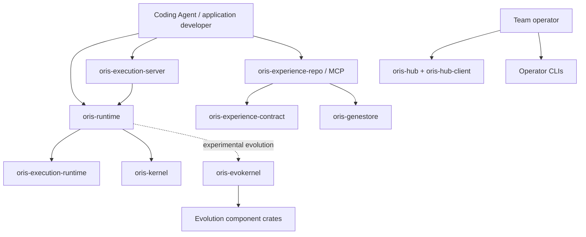

# Oris public crate catalog

This catalog defines the Rust packages that form Oris's external surface. It separates a package that Cargo *allows* to be published from a crate that users should adopt as a primary product entry point.

The inventory was generated from `cargo metadata --no-deps --format-version 1` on 2026-08-12 and checked against the crates.io API on the same date.

## Inventory summary

| Category | Count | Meaning |
|---|---:|---|
| Workspace packages | 30 | Every Cargo package listed as a workspace member |
| Publishable candidates | 24 | `publish` is not disabled in the manifest |
| Found on crates.io | 19 | A registry release exists under the same package name |
| Not yet on crates.io | 5 | Local package is publishable in principle but has no registry release |
| Non-publishable examples | 6 | Explicit `publish = false` packages under `examples/` |

“Publishable candidate” is a manifest fact, not a maturity guarantee. Users should normally begin with `oris-runtime`, `oris-execution-server`, or the Oris Experience MCP package. The lower-level evolution crates remain useful for advanced integrations but are not independent end-user products.

## Recommended external product surface



### Primary entry points

| Crate | Local version | Registry | Intended user | Contract |
|---|---:|---|---|---|
| `oris-runtime` | 0.61.0 | 0.61.0 | Rust Agent and workflow developers | Main facade for graph, agent, tools, model, memory, RAG and feature-gated evolution/runtime capabilities |
| `oris-execution-server` | 0.2.12 | 0.2.12 | Service developers | Thin HTTP execution-server facade over `oris-runtime` |
| `oris-experience-repo` | 0.3.0 | 0.3.0 | Coding Agents and local/team operators | Experience control plane, REST API, STDIO MCP server, evidence store and lifecycle governance |
| `oris-experience-contract` | 0.1.0 | not published | Agent/SDK authors | Canonical `ExperienceBundleV1`, Gene, Capsule and UsageReceipt wire contract |

Recommended installation paths:

```toml
# General Rust application
[dependencies]
oris-runtime = "0.61"

# HTTP execution service
[dependencies]
oris-execution-server = "0.2.12"

# Typed cross-Agent experience contract, until published use a pinned Git revision
[dependencies]
oris-experience-contract = { git = "https://github.com/Colin4k1024/Oris", rev = "<commit>" }
```

Coding Agent users should use the packaged Skill and MCP binary rather than embed the entire Rust runtime. See [Coding Agent onboarding](coding-agent-onboarding.md).

## Complete publishable crate inventory

### Runtime and execution layer

| Crate | Version | Target | Direct Oris dependencies | Registry state | Recommended status |
|---|---:|---|---|---|---|
| `oris-runtime` | 0.61.0 | library | `oris-kernel`, `oris-execution-runtime`, optional `oris-evokernel` | published 0.61.0 | Primary public facade |
| `oris-execution-server` | 0.2.12 | library | `oris-runtime` | published 0.2.12 | Public service facade |
| `oris-execution-runtime` | 0.3.0 | library | `oris-kernel` | published 0.3.0 | Public advanced runtime API |
| `oris-kernel` | 0.2.13 | library | none | published 0.2.13 | Public deterministic kernel API |

`oris-runtime` has roughly 80 features and is intentionally broad. New users should rely on its default/stable surface and enable only the specific persistence, provider, or experimental feature they need. `oris-execution-server` re-exports selected server and runtime types; it is not a second independent runtime.

### Governed experience layer

| Crate | Version | Target | Direct Oris dependencies | Registry state | Recommended status |
|---|---:|---|---|---|---|
| `oris-experience-contract` | 0.1.0 | library | none | not published | Canonical public contract; publish first |
| `oris-experience-repo` | 0.3.0 | library + `oris-experience-mcp` binary | `oris-experience-contract`, `oris-genestore`, `oris-evolution`, `oris-evolution-network` | published 0.3.0 | Primary Experience service/MCP product |
| `oris-genestore` | 0.2.0 | library | none | published 0.2.0 | Legacy/internal Gene store and replay primitives |
| `oris-hub` | 0.1.0 | library + `oris-hub` binary | `oris-evolution` | not published | Alpha team discovery/federation service |
| `oris-hub-client` | 0.1.0 | library | `oris-hub` | not published | Alpha client SDK; currently coupled to server crate types |
| `oris-exp-repo-cli` | 0.1.0 | binary | none | not published | Alpha Experience API-key administration CLI |

`oris-experience-contract` is the only authoritative cross-Agent wire model. New integrations should not build directly against the older `oris-genestore::Gene` model. `oris-experience-repo` keeps legacy conversion only for compatibility.

`oris-hub-client` currently depends on `oris-hub` for shared types. Before treating it as a stable SDK, shared request/response models should move to a small contract crate so client users do not inherit server implementation dependencies.

### Evolution component layer

| Crate | Version | Direct Oris dependencies | Registry state | Responsibility |
|---|---:|---|---|---|
| `oris-evokernel` | 0.14.1 | all principal evolution components | published 0.14.1 | Supervised capture, validation, solidification and replay orchestration |
| `oris-evolution` | 0.4.1 | `oris-kernel` | published 0.4.1 | Append-only evolution memory, task matching, pipeline and ports |
| `oris-agent-contract` | 0.5.5 | none | published 0.5.5 | External Agent proposal, A2A and replay-feedback contracts |
| `oris-governor` | 0.3.2 | `oris-evolution` | published 0.3.2 | Promotion, cooldown, revocation and evidence policy |
| `oris-sandbox` | 0.3.0 | `oris-evolution` | published 0.3.0 | Local bounded mutation application and resource limits |
| `oris-mutation-evaluator` | 0.3.0 | none | published 0.3.0 | Static analysis and optional LLM mutation critic |
| `oris-intake` | 0.4.0 | `oris-agent-contract`, `oris-evolution` | published 0.4.0 | CI/issue signal intake, admission, evidence and prioritization |
| `oris-spec` | 0.2.2 | `oris-evolution` | published 0.2.2 | OUSL YAML contracts and mutation-plan compiler |
| `oris-evolution-network` | 0.5.0 | `oris-evolution` | published 0.5.0 | Signed envelopes, sync, gossip and network protocol types |
| `oris-economics` | 0.2.0 | none | published 0.2.0 | Local EVU ledger, replay ROI and reputation accounting |
| `oris-orchestrator` | 0.5.0 | `oris-agent-contract`, `oris-evolution`, `oris-intake` | registry 0.4.3 | Advanced orchestration and release-control primitives; local version is ahead of registry |

These crates expose public Rust types, but the product boundary remains supervised and feature-gated. Ordinary application developers should prefer the `oris-runtime` facade. Direct component adoption is appropriate when an integrator needs to replace a store, governor, sandbox, evaluator, intake source, or network adapter.

### Compatibility services and operator tools

| Crate | Version | Target | Direct Oris dependencies | Registry state | Recommended status |
|---|---:|---|---|---|---|
| `oris-evo-ipc-protocol` | 0.1.0 | library | none | published 0.1.0 | JSON-RPC IPC compatibility contract |
| `oris-evo-server` | 0.1.0 | library | IPC protocol plus seven evolution crates | not published | Legacy Claude Code IPC service; prefer Experience MCP for new Agent integrations |
| `evolution-cli` | 0.1.0 | binary | `oris-evo-ipc-protocol` | published 0.1.0 | Legacy Gene Pool IPC operator CLI |

The IPC path remains useful for compatibility but should not compete with the standard MCP experience path. New Claude Code, Codex, OpenCode, Grok and custom Agent integrations should use `oris-experience-mcp` and `ExperienceBundleV1`.

## Packages intentionally excluded from publication

These workspace packages declare `publish = false` and are examples or reference applications, not public crates:

| Package | Purpose |
|---|---|
| `evo_oris_repo` | Evolution scenario and benchmark suite |
| `vector_store_surrealdb` | SurrealDB vector-store example |
| `oris_starter_axum` | Axum execution-server starter |
| `oris_worker_tokio` | Tokio worker reference implementation |
| `oris_operator_cli` | Example operator client |
| `plugin_reference` | External graph-node plugin layout reference |

Users consume these from the repository; they should not be added as crates.io dependencies.

## Current publication gaps

The current manifests expose more packages than the repository presents as supported products. Before the next coordinated release, resolve the following:

### Metadata consistency

Among the 24 publishable candidates:

- 22 have no package README;
- 21 have no explicit docs.rs `documentation` URL;
- 12 have no `repository` field;
- 10 have no `rust-version`.

Every public crate should inherit shared workspace metadata and either have a crate-specific README or deliberately reference a relevant root guide. A generic project README is insufficient for low-level crates because it does not explain their API boundary.

### Registry/version consistency

- `oris-orchestrator` is 0.5.0 locally while crates.io reports 0.4.3.
- `oris-experience-contract`, `oris-hub`, `oris-hub-client`, `oris-exp-repo-cli`, and `oris-evo-server` were not found on crates.io.
- The crates.io name `oris` belongs to an unrelated Monkey interpreter; Oris must continue using scoped names such as `oris-runtime` and should not document `cargo install oris` until the naming conflict has an explicit resolution.

### Path dependency blockers

The following publishable packages use local path dependencies without a registry version:

- `oris-experience-repo` → `oris-experience-contract`, `oris-genestore`, `oris-evolution`, `oris-evolution-network`;
- `oris-hub` → `oris-evolution`;
- `oris-hub-client` → `oris-hub`;
- `oris-evo-server` → its Oris component dependencies.

Cargo packages intended for crates.io must specify both a version and a local path, for example:

```toml
oris-experience-contract = { version = "0.1", path = "../oris-experience-contract" }
```

### Product overlap

- `oris-genestore` and `oris-experience-contract` define different generations of experience types. New public integrations must use `ExperienceBundleV1`.
- `oris-evo-server`/`evolution-cli` and `oris-experience-mcp` overlap as Agent integration paths. MCP is the preferred future path; IPC should be labeled compatibility-only.
- `oris-hub-client` should not need the entire `oris-hub` server crate for shared models.
- `oris-runtime` and `oris-execution-server` must document facade ownership so users do not depend on both unnecessarily.

## Recommended release groups

Crates should be released in dependency order and as explicit product groups.

### Group A — core runtime

1. `oris-kernel`
2. `oris-execution-runtime`
3. `oris-runtime`
4. `oris-execution-server`

### Group B — governed experience

1. `oris-experience-contract`
2. `oris-genestore`, `oris-evolution`, `oris-evolution-network` when versions change
3. `oris-experience-repo`
4. packaged `oris-experience-mcp` binaries and Agent Skill bundle
5. `oris-hub`
6. `oris-hub-client`
7. `oris-exp-repo-cli`

### Group C — supervised evolution components

1. leaf contracts/components: `oris-agent-contract`, `oris-economics`, `oris-mutation-evaluator`
2. `oris-evolution`
3. `oris-governor`, `oris-sandbox`, `oris-spec`
4. `oris-evolution-network`, `oris-intake`
5. `oris-evokernel`
6. `oris-orchestrator`

### Group D — compatibility tooling

1. `oris-evo-ipc-protocol`
2. `oris-evo-server`
3. `evolution-cli`

Group D should receive only compatibility and security maintenance unless an ADR re-establishes IPC as a primary integration surface.

## Definition of a supported public crate

A package should be labeled “supported public” only when all of the following are true:

1. `publish` is enabled intentionally, not merely omitted.
2. Package metadata includes license, repository, documentation, README and MSRV.
3. Every non-dev local dependency includes a compatible registry version.
4. `cargo package` and `cargo publish --dry-run` pass from a clean checkout.
5. The public API has rustdoc and a minimal consumer example.
6. Its maturity and feature stability are documented.
7. Release order and SemVer impact are covered by the release process.
8. The crate has a named owner and a deprecation path.

Until these gates are automated, this catalog—not the absence of `publish = false`—defines the intended public surface.
